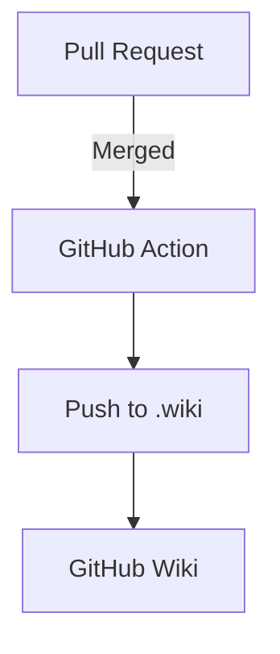

## Table of Contents

- [Maintaining the GitHub Wiki](#maintaining-the-github-wiki)
  - [Introduction](#introduction)
  - [Setting up the wiki repository](#setting-up-the-wiki-repository)
    - [Clone the *`<repository>.wiki`* repository](#clone-the-repositorywiki-repository)
    - [Rename the cloned directory](#rename-the-cloned-directory)
    - [Create a new repository on GitHub](#create-a-new-repository-on-github)
    - [Remove the origin from the cloned repository](#remove-the-origin-from-the-cloned-repository)
    - [Add the new repository as the origin](#add-the-new-repository-as-the-origin)
    - [Push the cloned repository to the new GitHub repository](#push-the-cloned-repository-to-the-new-github-repository)
  - [Create workflow](#create-workflow)
    - [Create a GitHub Action workflow](#create-a-github-action-workflow)
    - [Create Github access token](#create-github-access-token)
    - [Setting up GitHub secrets](#setting-up-github-secrets) 
  - [Repository structure](#repository-structure)
  - [How it works](#how-it-works)
  - [How to make changes](#how-to-make-changes)
    - [Clone the *`<repository>-wiki`* repository to your local machine.](#clone-the-repository-wiki-repository-to-your-local-machine)
    - [Create a new branch for your changes.](#create-a-new-branch-for-your-changes)
    - [Make your edits to the markdown files in the repository.](#make-your-edits-to-the-markdown-files-in-the-repository)
    - [Commit your changes and push them to the new branch.](#commit-your-changes-and-push-them-to-the-new-branch)
    - [Open a pull request from your branch into the main branch of the *`<repository>-wiki`* repository.](#open-a-pull-request-from-your-branch-into-the-main-branch-of-the-repository-wiki-repository)
    - [Merge the pull request.](#merge-the-pull-request)
    - [Delete the branch.](#delete-the-branch)
      
# Maintaining the GitHub wiki

## Introduction

GitHub Wikis are a convenient way to document projects, offering a simple interface for creating and managing content. However, their default editing experience poses significant limitations for collaborative and high-quality documentation efforts:

- **Live Edits Without Review**: All changes go live immediately, increasing the risk of publishing incomplete or incorrect content.
- **No Pull Requests or Reviews**: Wikis lack support for pull requests, making it difficult to review and manage contributions from multiple collaborators.
- **Limited Version Control Interface**: Although GitHub tracks changes, the wiki interface does not make it easy to compare revisions or revert changes effectively.

To overcome these limitations, this guide proposes using a separate GitHub repository to manage wiki content. This approach mirrors the official wiki while enabling a structured, collaborative documentation workflow. Key benefits include:

- **Pull Requests for Edits**: Contributors can submit changes via pull requests, enabling review, discussion, and approval before publishing.
- **Branch-Based Collaboration**: Multiple contributors can work in parallel without risking conflicts or overwrites.
- **CI/CD Integration with GitHub Actions**: Automated workflows push approved changes to the official GitHub Wiki, ensuring only vetted content is published.

This setup brings the rigor of modern software development—version control, code review, and automation—to your documentation process. It improves quality, reduces errors, and supports transparent collaboration.

The approach draws inspiration from best practices in the developer community, including:
- [The Secret GitHub Wiki Repo and CI/CD for Docs](https://medium.com/@thecybermonk/the-secret-github-wiki-repo-and-ci-cd-for-docs-fafe2583b72e) by [Sami Jawhar](https://github.com/sjawhar)
- [GitHub Wiki Tutorial for Technical Wiki Documentation](https://sparkbox.com/foundry/github_wiki_tutorial_for_technical_wiki_documentation) by [Ricardo Feiring](https://github.com/rfearing)


Both provide detailed guidance on setting up a standalone repository and integrating GitHub Actions for seamless documentation delivery.

For further information and context:

* GitHub Docs: [Creating and viewing wiki pages](https://docs.github.com/en/communities/documenting-your-project-with-wikis/creating-and-viewing-wiki-pages)
* GitHub Actions: [Creating a GitHub Action](https://docs.github.com/en/actions/creating-actions)

Whether you're fixing a typo, adding visuals, or documenting a new feature, this guide will walk you through contributing to the wiki in a maintainable, reviewable, and traceable way.

## Placeholder Convention
This guide uses angle brackets (`<...>`) to represent placeholders. Replace them with real values:
- `<repository-url>` → `https://github.com/your-org/your-repo`
- `<repository>` → `your-repo`
- `<workflow-name>` → `sync-wiki.yml`

## Setting up the wiki repository
The wiki is maintained in a separate repository named *`<repository>-wiki`*. This repository contains all the markdown files and assets used in the wiki. The actual GitHub Wiki is a separate repository called *`<repository>.wiki`*.

### Clone the *`<repository>.wiki`* repository
The first step is to clone the *`<repository>.wiki`* repository to your local machine. This repository contains the actual wiki content that is displayed on GitHub.

```bash
git clone <repository-url>.wiki.git
```
### Rename the cloned directory
After cloning the repository, rename the cloned directory to *`<repository-url>-wiki`*. This will be the main repository where all wiki content is stored and versioned.

```bash
mv <repository_url>.wiki <repository_url>-wiki
```

### Create a new repository on GitHub
Next, create a new repository on GitHub named *`<repository-url>-wiki`*. This will be the main repository where all wiki content is stored and versioned. Make sure to initialize the repository with a README file.
- Go to your GitHub account.
- Click on the **+** icon in the top right corner and select **New repository**.
- Name the repository *`<repository-url>-wiki`*.
- Add a description (optional).
- Choose whether to make the repository public or private.
- Initialize the repository with a README file.
- Click on **Create repository**.

### Remove the origin from the cloned repository
After creating the new repository, you need to remove the origin from the cloned repository. This is necessary to prevent any conflicts when pushing changes to the new repository.

```bash
cd repository-wiki
git remote remove origin
```

### Add the new repository as the origin
Now, add the new repository as the origin for the cloned repository. This will allow you to push changes to the new repository.

```bash
git remote add origin <repository-url>-wiki.git
```

### Push the cloned repository to the new GitHub repository
Finally, push the cloned repository to the new GitHub repository. This will upload all the wiki content to the new repository.

```bash
git push -u origin main 
```

## Create workflow

### Create a GitHub Action workflow
The next step is to create a GitHub Action workflow that will automatically push changes from the *`<repository>-wiki`* repository to the *`<repository>.wiki`* repository whenever a pull request is merged into the **main** branch of the *`<repository>-wiki`* repository.


You can create a new workflow by following these steps:
- Go to the **`<repository>-wiki`** repository on GitHub.
- Click on the **Actions** tab.
- Click on the **New workflow** button.
- Choose **Set up a workflow yourself**.
- This will create a new file called **`main.yml`** in the **`.github/workflows`** directory.

You can also create the workflow file manually by following these steps:
- Create a new directory called **`.github/workflows`** in the **`<repository>-wiki`** repository.
- Inside this directory, create a new file called **`<workflow-name>.yml`**.

Add the following content to the file:

```yaml
# Replace the following placeholders:
# <repository-url> with your GitHub repo slug (e.g., github.com/your-org/repo)
# ${{ secrets.API_KEY }} with a Personal Access Token stored in GitHub Secrets
# ${{ secrets.USERNAME }} with your GitHub username in GitHub Secrets
# ${{ secrets.EMAIL }} with your GitHub email in GitHub Secrets
# This workflow will push changes to the GitHub Wiki whenever a pull request is merged into the main branch of the <repository>-wiki repository.

name: Push Wiki to GitHub Wiki

on:
  push:
    branches:
      - main

jobs:
  build:
    runs-on: ubuntu-latest

    steps:
      - name: Set up Git
        run: |
          git config --global user.email "${{ secrets.EMAIL }}"
          git config --global user.name "${{ secrets.USERNAME }}"

      - name: Clone the target wiki repository
        run: |
          git clone https://${{ secrets.API_KEY }}@<repository-url>-wiki.git wiki 2>/dev/null
          
      - name: Push to Wiki
        run: |
          cd wiki
          git remote remove origin || true # || true to ignore error if no remote is set
          git remote add origin https://${{ secrets.API_KEY }}@<repository-url>.wiki.git 2>/dev/null
          git push origin main
```
### Create Github access token

To enable the GitHub Action to push changes to the *`<repository>.wiki`* repository, you need to create a GitHub Personal Access Token (PAT) with the necessary permissions. This token will be used for authentication when pushing changes to the wiki repository.
- Go to your GitHub account settings.
- Click on **Developer settings** in the left sidebar.
- Click on **Personal access tokens**.
- Click on **Tokens (classic)**.
- Click on the **Generate new token** button.
- Give your token a descriptive name (e.g., "Wiki Push Token").
- Select the expiration date for the token (e.g., 30 days).
- Click on the **Generate token** button.
- Copy the generated token and store it in a secure place. You will need this token to set up the GitHub Action.

### Setting up GitHub secrets

To enable the GitHub Action to push changes to the *`<repository>.wiki`* repository, you need to set up some repository secrets in the *`<repository>-wiki`* repository. These secrets are used for authentication and commit attribution.
- Go to the *`<repository>-wiki`* repository on GitHub.
- Click on the **Settings** tab.
- In the left sidebar, click on **Secrets and variables**.
- Click on **Actions**.
- Click on the **New repository secret** button.
- Add the following secrets:

| Variable  | Description                                                |
|-----------|------------------------------------------------------------|
| `API_KEY` | GitHub Personal Access Token with `repo` and `wiki` scopes |
| `USERNAME`| Your GitHub username (used for commit attribution)         |
| `EMAIL`   | Your GitHub email (used for commit attribution)            |


## How it works

- The *`<repository>.wiki`* repository is a GitHub Wiki that is automatically updated from the *`<repository>-wiki`* repository.
- The *`<repository>-wiki`* repository is where all contributors work on the wiki content.
- Contributors can clone the *`<repository>-wiki`* repository, make changes, and submit pull requests.
- The pull requests are reviewed and merged into the **main** branch of the *`<repository>-wiki`* repository.
- Once a pull request is merged, a GitHub Action is triggered to push the changes to the *`<repository>.wiki`* repository.

### Repository Structure Diagram

Use a tree-like text structure for clarity:
```markdown
📁 <repository>-wiki/
├── .github/
│   └── workflows/
│       └── sync-wiki.yml
├── README.md
├── index.md
└── images/
    └── diagram.png
```

## How to make changes

### Clone the *`<repository>-wiki`* repository to your local machine.
To make changes to the wiki, you need to clone the *`<repository>-wiki`* repository to your local machine. This repository contains all the markdown files and assets used in the wiki.

```bash
git clone <repository-url>.git
cd <repository>
```

### Create a new branch for your changes.
Before making any changes, create a new branch for your changes. This will help keep your changes organized and separate from the main branch.

```bash
git checkout -b update-wiki-section
```

### Make your edits to the markdown files in the repository.
- Open the markdown files in your favorite text editor.
- Edit the files as needed. You can use Markdown syntax to format your content.
- You can also create new markdown files or folders as needed.

### Commit your changes and push them to the new branch.
After making your changes, commit them to the new branch.

```bash
git add .
git commit -m "Update wiki section on harvesting"
git push origin update-wiki-section
```

### Open a pull request from your branch into the main branch of the *`<repository>-wiki`* repository.
- Go to the *`<repository>-wiki`* repository on GitHub.
- Click on the **Pull requests** tab.
- Click on the **New pull request** button.
- Select your branch from the dropdown menu and click **Create pull request**.
- Add a title and description for your pull request, explaining the changes you made.

### Merge the pull request.
Once the pull request is reviewed and approved, it will be merged into the **main** branch.
- This triggers a GitHub Action that automatically pushes the changes to the actual GitHub Wiki (*`<repository>.wiki`*).

### Delete the branch.
After the pull request is merged, you can delete the branch to keep the repository clean.
- Go to the **Pull requests** tab in the *`<repository>-wiki`* repository.
- Click on the **Merged** pull request.
- Click on the **Delete branch** button to delete the branch.
