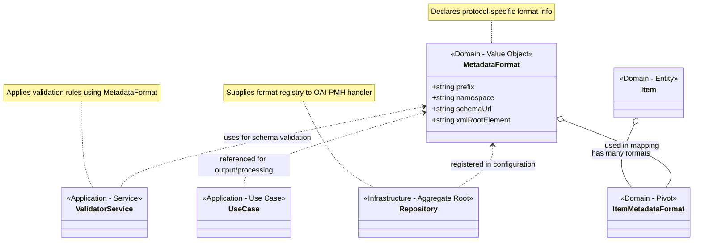

# MetadataFormat
## Purpose
The MetadataFormat class is a domain-level value object that describes the static characteristics and capabilities of a supported metadata format within the OAI-PMH protocol. It encapsulates all metadata format-related declarations required by the repository for correct protocol exposure and internal handling.

This class does not perform serialization, transformation, or I/O. Its purpose is to declare and constrain metadata format configurations used across the application.

## Properties

| Property          | Type    | Description                                                                 |
|-------------------|---------|-----------------------------------------------------------------------------|
| prefix            | string  | OAI-PMH metadataPrefix (e.g., oai_dc) used in protocol verbs.             |
| namespace         | string  | XML namespace associated with this format.                                 |
| schemaUrl         | string  | Fully qualified URI of the XSD schema defining the format structure.       |
| xmlRootElement    | string  | The root element of the XML representation for this format.                |

### Roadmap

The core properties are sufficient for the OI-PMH protocol and basic metadata handling. If additional properties are needed in the future, they can be added without breaking existing functionality. The current design focuses on immutability and simplicity, ensuring that the class remains a pure domain object.

Suggestions for future properties could include:

| Property          | Type    | Description                                                                 |
|-------------------|---------|-----------------------------------------------------------------------------|
| schemaVersion     | string  | Version of the metadata format/schema (optional; useful for internal version tracking). |
| mimeType          | string  | The MIME type associated with this format (optional).                     |
| readable          | bool    | Indicates if metadata in this format can be harvested/exported.           |
| writable          | bool    | Indicates if metadata in this format can be imported/stored via custom logic. |

## Responsibilities
The MetadataFormat class is responsible for:
- Declaring static format metadata used in OAI-PMH protocol operations.
- Serving as a source of truth for format-specific capabilities (e.g., can it be read/written?).
- Associating the format with a schema validator (via class reference).
- Enabling extensibility without coupling to infrastructure or serialization code.

## Design Constraints
- **Immutability**: All properties are set via constructor and marked readonly.
- **Pure domain logic**: No XML generation, parsing, validation, or I/O occurs within this class.
- **Framework-agnostic**: Can be reused in any context (CLI, web, etc.).

## Usage Scenarios
- In ListMetadataFormats response:

```php
$metadataFormat->prefix; // Used in protocol output
$metadataFormat->namespace;
$metadataFormat->schemaUrl;
```

- In GetRecord response:

```php
$metadataFormat->xmlRootElement; // Used in XML serialization
```

- In validation:

```php
$metadataFormat->schemaUrl; // Used to validate incoming metadata
```

## Relationship in the Domain Model
- ItemMetadataFormat (pivot) associates ItemType with MetadataFormat
- One Item may support multiple MetadataFormat representations
- MetadataFormat does not depend on Item, maintaining separation of concerns



## Extensibility Strategy
To introduce a new metadata format (e.g., mods or qdc):
- Instantiate a new MetadataFormat object
- Provide appropriate schema information and validator class
- Register the format in the Repository aggregate or a service configuration

## Summary

| Role               | Value                                                                 |
|---------------------|-------------------------------------------------------------------------|
| Layer             | Domain                                                                  |
| Type              | Value Object                                                            |
| Concerns          | Format identity, capabilities, and validation metadata                  |
| No responsibilities | Rendering, parsing, transport, or HTTP concerns                        |
| Used by           | Use cases, ViewModels, Validator services                               |
