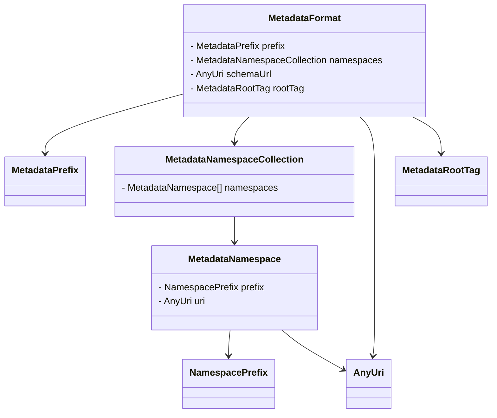
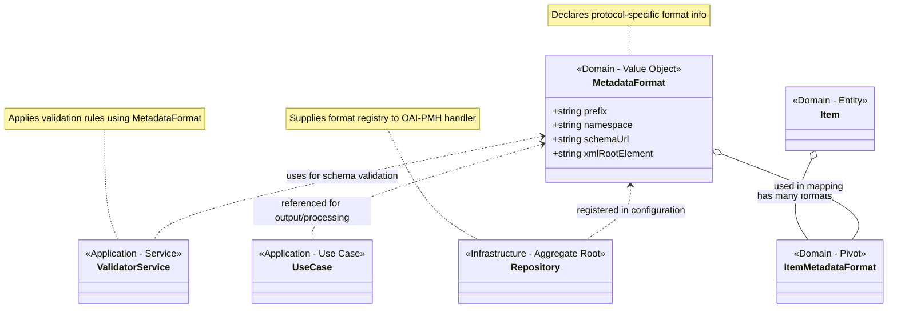

# MetadataFormat
## Purpose
The `MetadataFormat` value object models a single metadata format declaration as defined by the [OAI-PMH](https://www.openarchives.org/OAI/openarchivesprotocol.html) specification. It encapsulates key information required by OAI-PMH clients to understand and request metadata in a specific format—namely the format's prefix, XML namespaces, and schema URL.

This object exists as a value object in the domain model to provide:
- Immutability: Once created, a `MetadataFormat` cannot be altered, ensuring consistency and preventing accidental mutations.
- Clarity: It isolates metadata format logic from protocol or repository concerns, making the codebase easier to reason about.
- Domain encapsulation: It represents a core OAI-PMH concept explicitly, improving alignment with the protocol and making the model more expressive.

Using a dedicated value object makes interactions with metadata formats predictable and testable, while encouraging clean architecture and separation of concerns.

## Class structure
The `MetadataFormat` encapsulates the definition of a single metadata format used in the OAI-PMH protocol. It is composed of four strongly-typed value objects, each representing a core aspect of the format. The class is immutable and designed to express intent clearly, without exposing internal mutation or protocol-side logic.

| Property         | Type            | Description                                                                |
|------------------|-----------------|----------------------------------------------------------------------------|
| `prefix`         | `MetadataPrefix`  | OAI-PMH metadataPrefix (e.g., `oai_dc`) used in protocol verbs.              |
| `namespaces`     | `MetadataNamespaceCollection`  | Collection of namespaces associated with the metadata format, including prefixes and URIs. |
| `schemaUrl`      | `AnyUri`          | Fully qualified URI of the XSD schema defining the format structure.       |
| `xmlRootElement` | `MetadataRootTag` | The root element of the XML representation for this format.                |

🔒 Note: The `xmlRootElement` is not part of the OAI-PMH response but is used internally by the application. It defines the expected root XML element (e.g., `oai_dc:dc`) during serialization and helps ensure the generated XML matches the structure defined by the schema. This internal role supports both formatting and validation behind the scenes.

## Context diagram
The following diagram illustrates the relationships between the `MetadataFormat` class and its components:

## Context in OAI-PMH
In the OAI-PMH protocol, a metadata format defines how metadata is structured and exchanged. Each repository must support at least one format—commonly Dublin Core (`oai_dc`)—and can offer others based on institutional or domain-specific needs.

Metadata formats serve two key purposes in OAI-PMH:
- Discovery via `ListMetadataFormats`:
  Clients can query which formats are available using the `ListMetadataFormats` verb. Each format listed must include:
    - `metadataPrefix`: A short identifier used in requests (e.g., `oai_dc`, `marc21`).
    - `schema`: A URL to the XML Schema Definition (XSD) for validation.
    - `metadataNamespace`: The XML namespace URI that defines the vocabulary.
- Formatting Metadata Records:
  When clients request records using `GetRecord` or `ListRecords`, they specify a `metadataPrefix` to indicate the desired metadata format. The repository then uses the corresponding metadata format definition to generate the response in the appropriate structure.

🔒 Note: The `xmlRootElement` is not part of the OAI-PMH response but is used internally by the application. It defines the expected root XML element (e.g., `oai_dc:dc`) during serialization and helps ensure the generated XML matches the structure defined by the schema. This internal role supports both formatting and validation behind the scenes.

By encapsulating all this information in a `MetadataFormat` value object, the system maintains a clean separation between protocol representation and application logic, while supporting accurate metadata generation for harvesting.

## Validation
Instead of validating directly within the `MetadataFormat` constructor, validation is delegated to its constituent value objects. In the following table, we see how each property is validated through its own dedicated value object:

| Property       | Validated In                          | Validation Behavior                                      |
|----------------|----------------------------------------|----------------------------------------------------------|
| `prefix`         | `MetadataPrefix`                         | Must be a non-empty, valid OAI identifier                |
| `namespaces`     | `MetadataNamespaceCollection / MetadataNamespace` | Must be non-empty, each with a valid prefix and URI      |
| `schemaUrl`      | `AnyUri`                                 | Must be a well-formed URI                                |
| `xmlRootElement` | `MetadataRootTag`                        | Must be a non-empty XML element name                     |

## Relationship in the Domain Model
- ItemMetadataFormat (pivot) associates ItemType with MetadataFormat
- One Item may support multiple MetadataFormat representations
- MetadataFormat does not depend on Item, maintaining separation of concerns

## Extensibility Strategy
To introduce a new metadata format (e.g., mods or qdc):
- Instantiate a new MetadataFormat object
- Provide appropriate schema information and validator class
- Register the format in the Repository aggregate or a service configuration

## Summary

| Role               | Value                                                                 |
|---------------------|-------------------------------------------------------------------------|
| Layer             | Domain                                                                  |
| Type              | Value Object                                                            |
| Concerns          | Format identity, capabilities, and validation metadata                  |
| No responsibilities | Rendering, parsing, transport, or HTTP concerns                        |
| Used by           | Use cases, ViewModels, Validator services                               |
