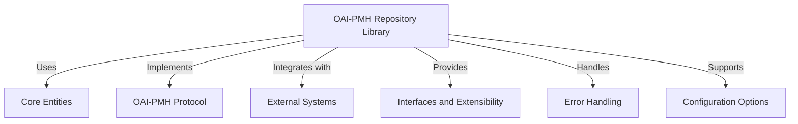
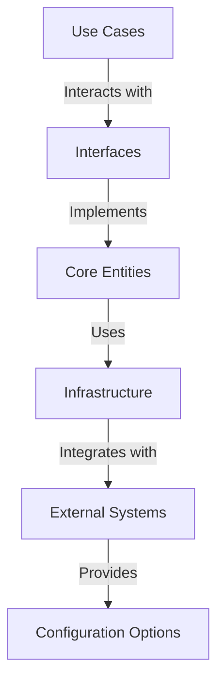
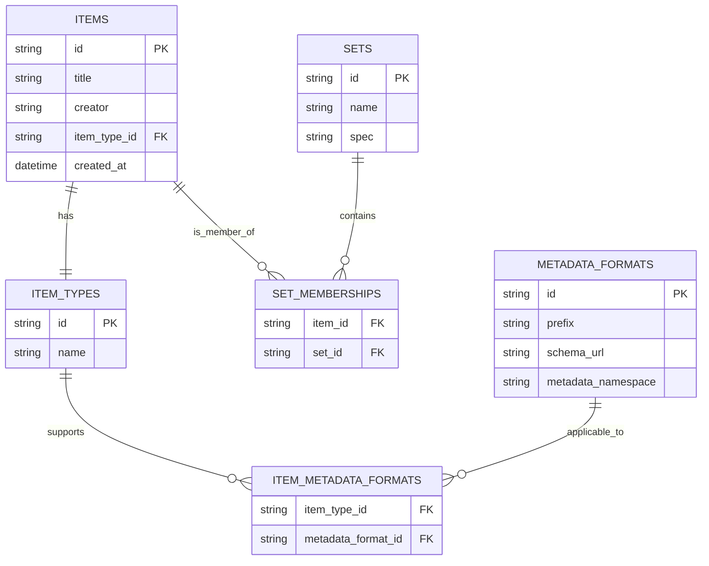

# OAI-PMH Repository Library

## Table of Contents

## Introduction

### Purpose of the Library
The OAI-PMH Repository Library is designed to provide a modular, framework-agnostic implementation of the Open Archives Initiative Protocol for Metadata Harvesting (OAI-PMH) v2.0. It aims to facilitate the exposure of metadata from repositories to harvesters, enabling interoperability and data sharing across different systems.

### Intended Audience
This document is intended for developers, system architects, and technical stakeholders involved in the implementation and integration of OAI-PMH in PHP-based repository applications. It assumes familiarity with PHP programming, object-oriented design principles, and the OAI-PMH protocol.

### Scope of the Document
This document outlines the architecture and key design concepts of the OAI-PMH Repository Library, a modular, PHP-based implementation of the Open Archives Initiative Protocol for Metadata Harvesting (OAI-PMH) v2.0.

## Overview

### What is OAI-PMH?
The Open Archives Initiative Protocol for Metadata Harvesting (OAI-PMH) is a protocol designed to facilitate the exchange of metadata between repositories and service providers. It allows repositories to expose their metadata in a standardized format, enabling harvesters to collect and aggregate metadata from multiple sources.

OAI-PMH is widely used in digital libraries, institutional repositories, and other metadata-rich environments to promote interoperability and data sharing.

### Library Goals
The OAI-PMH Repository Library aims to achieve the following goals:
- **Modularity**: The library is designed to be modular and extensible, allowing developers to customize and extend its functionality based on their specific needs.
- **Framework-Agnostic**: The library is framework-agnostic, meaning it can be integrated into any PHP-based application, regardless of the underlying framework (e.g., Laravel, Symfony).
- **Compliance with OAI-PMH**: The library adheres to the OAI-PMH v2.0 specification, ensuring that it can communicate effectively with harvesters and other OAI-PMH-compliant systems.

### Key Features
- **Support for OAI-PMH Verbs**: The library supports all six OAI-PMH verbs (Identify, ListRecords, ListIdentifiers, GetRecord, ListMetadataFormats, and ListSets) to facilitate metadata harvesting.
- **Metadata Format Support**: The library allows for the registration of multiple metadata formats, enabling repositories to expose their metadata in various schemas (e.g., Dublin Core, MODS).
- **Set Management**: The library supports the concept of sets, allowing repositories to group items logically for selective harvesting.
- **Extensible Architecture**: The library is designed with a clean architecture, separating concerns and allowing for easy extension and customization of components.
- **Error Handling**: The library provides robust error handling mechanisms, including OAI-PMH error codes and internal exceptions, to ensure reliable operation and clear communication of issues.

### Design Philosophy (e.g., Clean Architecture, Framework-Agnostic)
The OAI-PMH Repository Library is designed with Clean Architecture principles in mind. This approach emphasizes the separation of concerns, allowing for a clear distinction between the core business logic and the infrastructure components. By decoupling the protocol logic from the underlying framework, the library can be easily integrated into various PHP applications without being tied to a specific framework.

This design philosophy promotes testability, maintainability, and flexibility, enabling developers to adapt the library to their specific needs while adhering to the OAI-PMH protocol.

## System Context

### External Systems / Harvesters
The OAI-PMH Repository Library interacts with external systems, primarily OAI-PMH harvesters. These harvesters are client applications that collect and aggregate metadata from multiple repositories. They send requests to the repository using the OAI-PMH protocol and expect standardized XML responses.

### Integration in a PHP App
The library can be integrated into any PHP-based application, regardless of the underlying framework. It provides a set of interfaces and classes that can be easily adapted to fit the specific architecture and design patterns of the application.

### Role within the Repository Ecosystem
The OAI-PMH Repository Library serves as a bridge between the repository's internal data structures and the external world of metadata harvesting. It exposes the repository's metadata through standardized OAI-PMH endpoints, allowing harvesters to access and collect metadata efficiently.

## Architecture

### High-Level Architecture Diagram

### Layers (e.g., Use Cases, Interfaces, Infrastructure)


### Responsibilities by Layer
- **Use Cases**: Define the core business logic and interactions with the OAI-PMH protocol.
- **Interfaces**: Provide abstractions for core entities, allowing for easy extension and customization.
- **Core Entities**: Represent the key concepts in the OAI-PMH protocol, such as Items, Metadata Records, Sets, and Verbs.
- **Infrastructure**: Handle the low-level details of data storage, network communication, and XML serialization.
- **External Systems**: Interact with harvesters and other OAI-PMH-compliant systems, providing standardized responses.
- **Configuration Options**: Allow for customization of the library's behavior and settings, enabling developers to adapt it to their specific needs.

## Core Entities and Relationships

### Table of Entities (what you already have)
The OAI-PMH Repository Library is built around a set of core entities that represent the key concepts in the OAI-PMH protocol. These entities include:

| Concept Name         | Description                                                                 |
|----------------------|-----------------------------------------------------------------------------|
| Item                | Represents a single record or object in the repository.                     |
| MetadataRecord      | Encapsulates metadata and its header for a given item.                      |
| Identifier          | A globally unique identifier for an item.                                  |
| Datestamp           | Represents the last modified time of a record, critical for selective harvesting. |
| Set                 | Represents logical groupings of items; may be hierarchical.                |
| MetadataFormat      | Defines a supported format with schema, namespace, and prefix.             |
| Repository          | The aggregate root that exposes the collection of Items, Sets, and supported Verbs. |
| ResumptionToken     | A pagination token for managing large result sets in harvesting.           |
| Verb                | Represents the 6 allowed operations (e.g. Identify, ListRecords).         |

Next to these core entities, there are additional concepts that are not part of the OAI-PMH protocol but are important for understanding the domain model. These include:

| Concept Name        | Description                                                                 |
|---------------------|-----------------------------------------------------------------------------|
| ItemType           | Represents the type of an item, which can be used to filter or categorize items. |
| ItemMetadataFormat | Represents the relationship between ItemTypes and MetadataFormats.               |
| SetMembership      | Represents the relationship between Items and Sets.                            |

### Repository
A **repository** is a server that exposes structured metadata about resources through a standardized protocol. It is a network-accessible server that can process OAI-PMH requests and return responses formatted in XML. The repository acts as a data provider in the OAI-PMH ecosystem, allowing service providers to harvest metadata from multiple repositories. Key characteristics of a repository include:
- **Metadata Exposure**: The repository exposes metadata records, which are typically about digital objects such as articles, datasets, or images. It does not necessarily provide the full content of these resources.
- **Standardized Responses**: All responses from the repository follow the OAI-PMH XML schema and protocol, ensuring consistency and interoperability.
- **Support for Six Protocol Requests (Verbs)**: The repository supports six protocol requests (verbs) that allow service providers to interact with the metadata. These verbs include:
  - `Identify`: Get information about the repository.
  - `ListMetadataFormats`: Find available metadata formats.
  - `ListSets`: List sets (optional grouping of records).
  - `ListIdentifiers`: Get record identifiers.
  - `ListRecords`: Get metadata records.
  - `GetRecord`: Retrieve a specific metadata record.

A repository is the **source of metadata** for harvesters, which are client applications that collect and aggregate metadata from multiple repositories.

### Item
An **item** is a core conceptual entity within a repository. It acts as a container that groups all metadata records associated with a single resource. It has the following characteristics:
- **Unique Identifier**: Each item is assigned a unique identifier, typically in the form of a URI. This identifier is used to refer to the item when harvesting metadata.
- **Represents a Resource**: An item corresponds to a specific resource. The nature of the resource is not restricted by OAI-PMH — it can be digital (like an image or PDF) or non-digital (like a book or artifact).
- **Multiple Metadata Records**: An item can have one or more associated metadata records, each in a different metadata format (e.g., Dublin Core, MARCXML). This supports metadata interoperability across systems.
- **Optional Set Membership**: Items may be grouped into *sets*, which are used for selective harvesting. An item can belong to zero, one, or multiple sets.

### Unique Identifier in OAI-PMH
A **unique identifier** is a critical concept in the OAI-PMH protocol, as it serves as the primary means of identifying and accessing metadata records. It is essential for ensuring that each record can be uniquely referenced and retrieved by clients. It is a string that is globally unique within the context of the repository and is used to identify a specific item or record. It has the following characteristics:
- **Globally Unique**: The identifier must be unique across all items in the repository and should not be reused.
- **Stable**: The identifier should remain unchanged for the lifetime of the item. If an item is updated or modified, its identifier should not change.
- **Repository-assigned**: The repository is responsible for generating and managing the unique identifiers. They are typically assigned when the item is created or ingested into the repository.
- **Opaque**: The identifier should not convey any information about the item itself. Clients should not attempt to infer any meaning or structure from the identifier.

There are no restrictions on the format of the identifier, but it is recommended to use a URI-like syntax to ensure interoperability. The identifier should be a string that can be easily parsed and understood by both humans and machines. A proposed format is to use the **OAI Identifier** scheme `oai:[repositoryId]:[localIdentifier]`, where:
- `oai` is the scheme identifier.
- `repositoryId` is a unique identifier for the repository (e.g., domain name).
- `localIdentifier` is a unique identifier assigned by the repository for the specific item.

The unique identifier is used in the following OAI-PMH operations:
- `GetRecord`
- `Identify`
- `ListIdentifiers`
- `ListRecords` (as part of the metadata record headers)

The purpose of the unique identifier is to provide a consistent and reliable way to reference items across different repositories and systems. It allows clients to retrieve specific metadata records and ensures that the same item can be accessed consistently, regardless of the metadata format or protocol used.

### Record
A **record** in OAI-PMH is a structured representation of metadata about a specific item in a repository. It is the fundamental unit of information that is exchanged between repositories and service providers. Each record contains metadata about an item, including its unique identifier, datestamp, and the actual metadata content in a specific format.

Structurally, a record consists of three main components:
1. **Header**: Contains metadata about the record itself, including the unique identifier, datestamp, and optional set membership.
2. **Metadata**: The actual metadata content about the item, expressed in a specific format (e.g., Dublin Core, MODS).
3. **About (optional)**: Additional information about the metadata itself, such as rights statements or provenance information.

Example Record Structure

```xml
<record>
  <header>
    <identifier>oai:example.org:record123</identifier>
    <datestamp>2025-05-18</datestamp>
    <setSpec>collectionA</setSpec>
  </header>
  <metadata>
    <oai_dc:dc xmlns:oai_dc="http://www.openarchives.org/OAI/2.0/oai_dc/"
               xmlns:dc="http://purl.org/dc/elements/1.1/">
      <dc:title>Sample Record Title</dc:title>
      <dc:creator>Jane Doe</dc:creator>
      <dc:subject>Metadata Harvesting</dc:subject>
      <dc:description>This is a sample description of the record.</dc:description>
      <dc:publisher>Example Publisher</dc:publisher>
      <dc:date>2025-05-18</dc:date>
      <dc:type>Text</dc:type>
      <dc:identifier>http://example.org/record123</dc:identifier>
    </oai_dc:dc>
  </metadata>
  <about>
    <rights xmlns="http://www.openarchives.org/OAI/2.0/rights/">
      <rightsStatement>This metadata is licensed under CC BY 4.0.</rightsStatement>
    </rights>
  </about>
</record>
```

Additional Notes
- **Uniqueness**: A record is uniquely identified by the combination of the item's identifier, the metadata format (`metadataPrefix`), and the datestamp.
- **Multiple Formats**: An item may have multiple records, each in a different metadata format.
- **Selective Harvesting**: The `datestamp` and `setSpec` elements facilitate selective harvesting by allowing harvesters to request records based on date ranges or set memberships.

### Deleted Records
OAI-PMH supports a mechanism for signaling that a record has been deleted. This is controlled by the repository's **deletion policy**, which may be:
- `no`: The repository does not maintain information about deletions.
- `transient`: The repository may indicate deletions, but not necessarily permanently.
- `persistent`: The repository retains knowledge of deletions indefinitely.

When a record is deleted:
- Only the `<header>` element is returned.
- The `<metadata>` and `<about>` elements are omitted.
- The `<header>` includes the attribute `status="deleted"`.

Example of a Deleted Record

```xml
<record>
  <header status="deleted">
    <identifier>oai:example.org:record123</identifier>
    <datestamp>2025-05-18</datestamp>
  </header>
</record>
```

Harvesters can use this information to remove or update local copies of records accordingly.

#### Items vs. Records

While an **item** represents a resource, a **record** is a single instance of metadata about that resource in a specific format.

Each metadata record includes:
- **Header**: Contains the item’s identifier, a datestamp (indicating last update), and optional set membership.
- **Metadata**: The actual descriptive metadata in XML format.
- **About** *(optional)*: Additional metadata about the metadata itself (e.g., rights information).

#### Summary

An `item` in OAI-PMH is an abstraction for a resource, grouping together all metadata records about that resource, potentially in multiple formats. It is the fundamental unit targeted by metadata harvesters.

### OAI-PMH: Understanding Sets
A set is a logical grouping of items within a repository. It allows repositories to organize their metadata records into collections based on specific criteria, enabling selective harvesting by service providers. Sets are optional constructs in OAI-PMH, meaning that not all repositories are required to implement them. However, they can be beneficial for both repositories and harvesters in terms of organization and efficiency.

The purpose of sets is to provide a way to categorize and group items within a repository. This can be particularly useful for large repositories with diverse collections, as it allows harvesters to request metadata from specific subsets of the repository rather than retrieving all records.
Sets can be defined based on various criteria, such as:
- Subject matter (e.g., collections related to specific research areas)
- Resource type (e.g., images, articles, datasets)
- Institutional affiliation (e.g., collections from specific departments or institutions)
- Any other classification that suits the repository's organizational needs
Sets are defined by the repository and can be hierarchical, meaning that sets can contain other sets. This allows for a more granular organization of metadata records.

The structure of a set in OAI-PMH includes the following components:
- **setSpec**: A unique identifier for the set within the repository. This is typically a short string that serves as a reference to the set.
- **setName**: A human-readable name for the set. This is intended for display purposes and should provide a clear description of the contents of the set.
- **setDescription** (optional): Additional information about the set, which can include metadata such as rights information or descriptive details. This is not required but can provide valuable context for harvesters.

Example

```xml
<set>
  <setSpec>physics:quantum</setSpec>
  <setName>Quantum Physics Collection</setName>
  <setDescription>
    <dc:description>This set contains metadata records related to quantum physics research.</dc:description>
  </setDescription>
</set>
```

#### Hierarchical Sets

OAI-PMH supports a hierarchical structure for sets, allowing for nested groupings. This hierarchy is implied through the use of colons (`:`) in the `setSpec`.

Example Hierarchy

```xml
<setSpec>physics</setSpec>
<setSpec>physics:quantum</setSpec>
<setSpec>physics:relativity</setSpec>
In this example:
```

physics is a top-level set.

physics:quantum and physics:relativity are subsets of physics.

Note: While the hierarchy is implied, OAI-PMH does not enforce inheritance of records from parent to child sets. Each set is treated independently.

#### Records and Set Membership
- **Multiple Set Membership**: A single metadata record can belong to multiple sets.
- **No Set Membership**: Records are not required to belong to any set.
- **Set Specification in Records**: When a record is part of a set, its header will include the corresponding `setSpec`.

Example Record Header
```xml
<header>
  <identifier>oai:example.org:record123</identifier>
  <datestamp>2025-05-18</datestamp>
  <setSpec>physics:quantum</setSpec>
  <setSpec>research:2025</setSpec>
</header>
```

In this example, the record belongs to both the physics:quantum and research:2025 sets.

#### Harvesting Sets
Harvesters can retrieve information about available sets using the ListSets verb:

```http
GET http://www.example.org/oai?verb=ListSets
```
To harvest records from a specific set, include the set parameter:

```http
GET http://www.example.org/oai?verb=ListRecords&metadataPrefix=oai_dc&set=physics:quantum
```
This request retrieves records from the physics:quantum set in the Dublin Core (oai_dc) metadata format.

#### Implementation Considerations
- **Optional Feature**: Implementing sets is optional for repositories. Not all repositories will have sets defined.
- **Set Hierarchy**: While a hierarchical structure can be implied through setSpec, OAI-PMH does not define semantics for set hierarchies. Repositories may choose to implement sets in a flat or hierarchical manner based on their organizational needs.
- **Empty Sets**: Repositories may define sets that currently have no records. This allows for future growth and organization of metadata.
- **Set Definition**: The meaning and criteria for sets are determined by the repository and may be based on internal policies or agreements with service providers.

### Domain Model Diagram


## Protocol Implementation

### Supported OAI-PMH Verbs and Their Behavior
The OAI-PMH Repository Library supports the following OAI-PMH verbs, each with its own specific behavior and response format:
- **Identify**: Returns information about the repository, including its name, protocol version, and available metadata formats.
- **ListRecords**: Retrieves a list of metadata records, optionally filtered by date range, set membership, and metadata format.
- **ListIdentifiers**: Returns a list of item identifiers, including their unique identifiers and datestamps.
- **GetRecord**: Retrieves a specific metadata record based on its unique identifier and requested metadata format.
- **ListMetadataFormats**: Lists the metadata formats supported by the repository, including their prefixes and schemas.
- **ListSets**: Returns a list of sets defined in the repository, including their specifications and names.

### Parameter Handling (e.g., from, until, set, metadataPrefix)
- **from**: Specifies the starting date for selective harvesting. Only records with a datestamp greater than or equal to this date will be returned.
- **until**: Specifies the ending date for selective harvesting. Only records with a datestamp less than or equal to this date will be returned.
- **set**: Specifies the set from which to harvest records. Only records belonging to this set will be returned.
- **metadataPrefix**: Specifies the metadata format to be used for the returned records. The repository will return records in the requested format if available.

- **identifier**: Specifies the unique identifier of the record to be retrieved. This is used with the GetRecord verb to fetch a specific metadata record.

### Resumption Tokens and Pagination
- **Resumption Token**: A token used for pagination in OAI-PMH. It allows harvesters to retrieve large result sets in multiple requests. The token is returned in the response when the result set exceeds the maximum number of records that can be returned in a single request.
- **Pagination**: The library supports pagination through the use of resumption tokens. When a request returns a large number of records, the response will include a resumption token that can be used to retrieve the next set of records.
- **maxRecords**: A configuration option that specifies the maximum number of records to return in a single request. This can be adjusted based on the repository's performance and resource constraints.

## Interfaces and Extensibility

### Interfaces for Item Providers, Format Serializers, etc.
The OAI-PMH Repository Library is designed to be extensible and modular, allowing developers to implement custom components for various aspects of the protocol. Key interfaces include:
- **ItemProviderInterface**: Defines methods for retrieving items and their associated metadata records.
- **MetadataFormatInterface**: Defines methods for handling metadata formats, including serialization and deserialization of metadata records.
- **SetProviderInterface**: Defines methods for managing sets and their memberships.
- **ErrorHandlerInterface**: Defines methods for handling errors and exceptions in a standardized manner.
- **RepositoryInterface**: Defines the core methods for interacting with the OAI-PMH protocol, including handling requests and generating responses.
- **ResponseFormatterInterface**: Defines methods for formatting responses in XML according to the OAI-PMH specification.
- **RequestValidatorInterface**: Defines methods for validating incoming requests and parameters.
- **ConfigurationInterface**: Defines methods for managing configuration options and settings for the library.
- **LoggerInterface**: Defines methods for logging events and errors within the library.

### How to Register Custom Implementations
Developers can register custom implementations of the interfaces by following these steps:
1. **Create Custom Classes**: Implement the desired interfaces in custom classes that provide the required functionality.
2. **Register Implementations**: Use a service container or dependency injection mechanism to register the custom implementations with the library.
3. **Configure the Library**: Update the library's configuration to specify the custom implementations to be used for specific components (e.g., item provider, metadata format).

### Configuration Options
The OAI-PMH Repository Library provides a configuration file that allows developers to customize various aspects of the library's behavior. Key configuration options include:
- **Repository Information**: Basic information about the repository, including its name, base URL, and contact information.
- **Metadata Formats**: A list of supported metadata formats, including their prefixes, schemas, and namespaces.
- **Set Definitions**: A list of sets defined in the repository, including their specifications and names.
- **Error Handling**: Configuration options for error handling, including custom error messages and logging settings.
- **Performance Settings**: Options for controlling pagination, maximum records per request, and caching behavior.
- **Logging Settings**: Options for configuring logging behavior, including log levels and output formats.
- **Custom Implementations**: Options for registering custom implementations of interfaces, such as item providers and metadata format serializers.

## Error Handling

### OAI-PMH Error Codes
The OAI-PMH protocol defines a set of standard error codes that can be returned in response to requests. These error codes indicate specific issues encountered during processing. The library implements these error codes to provide clear feedback to harvesters.

| Error Code         | Description                                                                 |
|---------------------|-----------------------------------------------------------------------------|
| badArgument        | The request includes illegal arguments, is missing required arguments, includes a repeated argument, or values for arguments have an illegal syntax. |
| badResumptionToken | The value of the resumptionToken argument is invalid or expired.            |
| badVerb            | Value of the verb argument is not a legal OAI-PMH verb, the verb argument is missing, or the verb argument is repeated. |
| cannotDisseminateFormat | The metadata format identified by the value given for the metadataPrefix argument is not supported by the item or by the repository. |
| idDoesNotExist     | The value of the identifier argument is unknown or illegal in this repository. |
| noRecordsMatch     | The combination of the values of the from, until, set and metadataPrefix arguments results in an empty list. |
| noMetadataFormats  | There are no metadata formats available for the specified item.            |
| noSetHierarchy     | The repository does not support sets.                                      |

### Internal Exceptions vs. Protocol Errors

### Usage Scenarios

## Integrating in Laravel / Symfony / Custom Framework

### Example Endpoints and Routes

### Example Config File

## Testing and Validation

### Unit Testing Strategy

### Validating Output Against OAI-PMH XSD Schemas

## Appendix

### Glossary

### References (OAI-PMH Spec, Related Standards)

### Changelog / Versioning Notes


