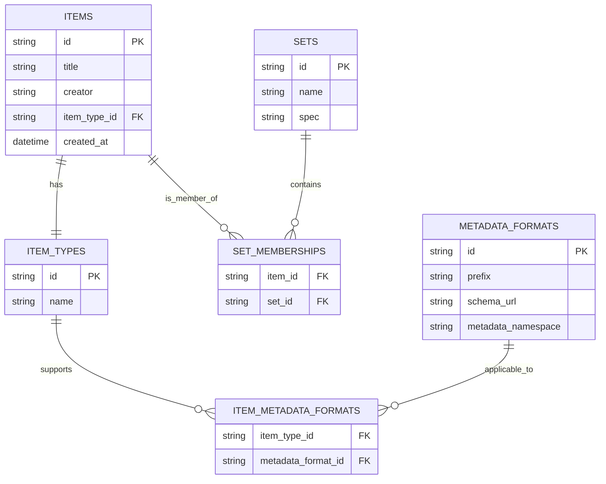

# OAI-PMH Repository Library

## Table of Contents

## Introduction

This document provides an architectural and conceptual overview of the **OAI-PMH Repository Library**, a PHP-based, modular library that implements the [Open Archives Initiative Protocol for Metadata Harvesting (OAI-PMH) version 2.0](https://www.openarchives.org/OAI/openarchivesprotocol.html). The library is designed to be framework-agnostic and can be integrated into any PHP-based repository system that needs to expose metadata to OAI-PMH harvesters.

The primary goal of the library is to simplify the implementation of an OAI-PMH-compliant data provider. It enables repositories to share structured metadata with external systems such as aggregators, harvesters, and digital library platforms, all in a standardized way.

The library is built following Clean Architecture principles, which ensures a clear separation of concerns between domain logic, use cases, and infrastructure. This architectural approach enhances the maintainability, testability, and extensibility of the codebase, allowing developers to customize and adapt it to different storage systems, metadata formats, and domain models.

This documentation serves as both a conceptual guide and a technical reference for understanding how the OAI-PMH Repository Library works, what components it consists of, and how it maps to the OAI-PMH specification. It is intended for:
- **Developers** integrating OAI-PMH capabilities into PHP applications
- **Architects** designing repository platforms that need metadata harvesting support
- **Contributors** extending the functionality of the library

The following chapters describe the library’s architecture, domain model, supported protocol features, and integration scenarios in detail.

## Overview
The **OAI-PMH Repository Library** is a PHP-based software component that implements the Open Archives Initiative Protocol for Metadata Harvesting (OAI-PMH) version 2.0. The protocol defines a simple HTTP-based mechanism that allows external systems - called **harvesters** or **service providers** - to retrieve structured metadata from data-providing repositories.

This library provides the building blocks needed to expose metadata from any PHP application in a way that complies with the OAI-PMH specification. It focuses on being:
- **Modular** -  Composed of independent components that are easy to replace or extend.
- **Framework-agnostic** -  Can be integrated into any PHP framework (e.g., Laravel, Symfony, Slim) or custom application.
- **Extensible** -  Allows developers to define custom metadata formats, set hierarchies, and item structures.
- **Specification-compliant** -  Ensures full support for the OAI-PMH v2.0 protocol, including all six verbs and selective harvesting.

### Key Features
- Implements all OAI-PMH verbs:
    - Identify
    - ListMetadataFormats
    - ListSets
    - GetRecord
    - ListIdentifiers
    - ListRecords
- Supports pagination with resumption tokens.
- Allows selective harvesting based on date ranges and sets.
- Supports multiple metadata formats (e.g., Dublin Core, MODS).
- Built with **Clean Architecture** for high separation of concerns and testability.

### Design Philosophy
The library is designed around the following principles:
- **Domain-centric**: Core protocol concepts (items, metadata, sets) are modeled as pure PHP classes.
- **Inversion of Control**: Application-specific logic (such as how items are stored or retrieved) is provided via interfaces.
- **Protocol as Orchestration**: OAI-PMH logic acts as a coordinator, relying on injected components to handle repository-specific behavior.

By decoupling protocol logic from infrastructure details, the library can serve a wide range of use cases—from academic repositories and digital archives to content management systems and custom-built research tools.

## System Context

The OAI-PMH Repository Library acts as the intermediary between a repository system and external harvesters by exposing repository metadata through a standardized protocol interface. This chapter explains the system's role within the broader ecosystem, the external actors it interacts with, and how it can be embedded in various PHP applications.

### Role in the OAI-PMH Ecosystem
OAI-PMH defines two main roles:
- **Data Provider**: A repository that exposes metadata via OAI-PMH endpoints.
- **Service Provider** (Harvester): An external system that retrieves metadata by sending OAI-PMH requests.

This library enables any PHP-based repository system to function as a **Data Provider** by exposing a compliant OAI-PMH interface.

### High-Level Data Flow

```csharp
Kopiëren
Bewerken
[Repository Storage] 
       ⬇
[Your Application (e.g., Laravel, Symfony)] 
       ⬇
[OAI-PMH Repository Library]
       ⬇
[OAI-PMH XML Response]
       ⬇
[Harvester]
```
1. A harvester sends a request (e.g., ListRecords) to your application.
2. Your application routes the request to the OAI-PMH Repository Library.
3. The library invokes configured interfaces to retrieve items, sets, and metadata.
4. The library formats the response in XML according to OAI-PMH v2.0.
5. The harvester receives the response and processes the metadata.

### Integration Scenarios
The library is designed to be embedded in a wide range of environments:
- **Framework-based Applications**: Easily integrated into PHP frameworks like Laravel, Symfony, or Slim via adapters and service bindings.
- **Custom PHP Applications**: Can be dropped into existing repositories with minimal dependencies.
- **Headless API Services**: Used to expose repository data independently of the main application UI.

Developers are responsible for implementing and binding the domain-specific interfaces (e.g., item providers, metadata formatters) to connect the library to their storage and application logic.

### Deployment and Hosting
Since the library is framework-agnostic, you are free to deploy it in any PHP environment that supports HTTP request handling. You may:
- Route OAI-PMH requests via your existing HTTP router or controller layer.
- Mount it as a dedicated endpoint (e.g., `/oai`) for harvesters.
- Serve metadata from an internal or external database, search index, or CMS

## Architecture
The **OAI-PMH Repository Library** is architected using the principles of Clean Architecture. This approach enforces a clear separation between business rules (protocol logic), application-specific implementations (e.g., data access), and delivery mechanisms (HTTP layer), resulting in a modular, maintainable, and testable codebase.

### Clean Architecture Overview
Clean Architecture separates code into concentric layers. Dependencies always point inward, ensuring that the core logic is never dependent on external frameworks or infrastructure.

Layers:
- **Entities (Domain Layer)**: Contains the protocol’s core domain concepts: Item, MetadataRecord, Set, MetadataFormat, etc. These are pure PHP classes without dependencies.
- **Use Cases (Application Layer)**: Contains logic for handling OAI-PMH verbs like ListRecords, Identify, etc. Each use case orchestrates calls to interfaces to retrieve and format data.
- **Interfaces (Abstractions Layer)**: Declares contracts (PHP interfaces) for accessing items, sets, and metadata. These must be implemented by the integrating application.
- **Frameworks & Drivers (Infrastructure Layer)**: Contains HTTP controllers, XML builders, and integrations. This is the outermost layer where actual input/output happens.

Key Benefits:
- Easy to swap storage engines or frameworks.
- Business logic stays independent of HTTP routing and XML formatting.
- Facilitates testing with mocks/stubs at every boundary.

### Component Overview
table
| Component Name       | Description                                                                 |
|----------------------|-----------------------------------------------------------------------------|
| OAI-PMH Repository   | The main entry point for handling OAI-PMH requests and coordinating verbs.  |
| VerbHandlers         | Classes that handle specific OAI-PMH verbs (e.g., GetRecordHandler).       |
| Interfaces\ItemRepositoryInterface | Abstracts item access; implemented by the consuming application. |
| XmlFormatter         | Converts internal representations into compliant OAI-PMH XML.             |
| ResumptionTokenService | Manages pagination state between requests.                                 |

Each component adheres to the Dependency Rule: outer layers depend on inner ones, never the reverse.

### Technology Stack
- **Language**: PHP 8.1+
- **Protocol**: OAI-PMH v2.0 (spec link)
- **Serialization**: Custom XML builder for strict spec compliance
- **Optional**: PSR-7/15 support for HTTP abstraction (middleware-ready)

### Architectural Diagram
Here's a conceptual diagram (you can render this in a visual form later):

```pgsql
+--------------------------+
|  Controllers / HTTP API |
+--------------------------+
            ⬇
+--------------------------+
|     Use Case Handlers    |   ← Verbs: Identify, ListRecords, etc.
+--------------------------+
            ⬇
+--------------------------+
|  Interfaces / Contracts  |   ← ItemProviderInterface, MetadataFormatterInterface
+--------------------------+
            ⬇
+--------------------------+
|     Domain Entities      |   ← Item, MetadataRecord, Set, etc.
+--------------------------+
```

## Domain Model
The domain model defines the core entities and relationships required to implement the OAI-PMH protocol. These entities represent metadata concepts described in the OAI-PMH v2.0 specification, abstracted into PHP classes that are decoupled from any infrastructure concerns.

This model also includes additional concepts that, while not part of the OAI-PMH protocol itself, are useful for organizing, filtering, and managing metadata within your repository.

### Core Entities
| Concept Name         | Description                                                                 |
|----------------------|-----------------------------------------------------------------------------|
| Item                | Represents a single record or object in the repository.                     |
| MetadataRecord      | Encapsulates metadata and its header for a given item.                      |
| Identifier          | A globally unique identifier for an item.                                  |
| Datestamp           | Represents the last modified time of a record, critical for selective harvesting. |
| Set                 | Represents logical groupings of items; may be hierarchical.                |
| [MetadataFormat](MetadataFormat.md)      | Defines a supported format with schema, namespace, and prefix.             |
| Repository          | The aggregate root that exposes the collection of Items, Sets, and supported Verbs. |
| ResumptionToken     | A pagination token for managing large result sets in harvesting.           |
| Verb                | Represents the 6 allowed operations (e.g. Identify, ListRecords).         |

### Supporting Domain Concepts
Next to these core entities, there are additional concepts that are not part of the OAI-PMH specification, but are important for modeling and extending the library’s functionality in real-world repositories:

| Concept Name        | Description                                                                 |
|---------------------|-----------------------------------------------------------------------------|
| ItemType           | Represents the type of an item, which can be used to filter or categorize items. |
| ItemMetadataFormat | Represents the relationship between ItemTypes and MetadataFormats.               |
| SetMembership      | Represents the relationship between Items and Sets.                            |

These concepts enrich the library’s data model and provide more control over the organization and exposure of repository content.

### Entity Relationships
The core relationships between entities can be summarized as:
- An Item:
    - Has a unique Identifier
    - Is timestamped with a Datestamp
    - Has one or more MetadataRecords, each in a specific MetadataFormat
    - Belongs to one or more Sets
    - Has an optional ItemType
- A MetadataFormat:
    - Defines serialization rules
    - May be restricted to certain ItemTypes via ItemMetadataFormat
- A Set:
    - Groups Items via SetMembership
    - May be static or dynamically assigned

Simplified Relationship Diagram
```plaintext
Item
 ├── Identifier
 ├── Datestamp
 ├── ItemType
 ├── MetadataRecord[]
 │    └── MetadataFormat
 ├── SetMembership[]
 │    └── Set
 └── ItemMetadataFormat[]
      └── MetadataFormat
```

## Protocol Implementation
This chapter describes how the OAI-PMH Repository Library implements the OAI-PMH v2.0 protocol operations (verbs) using the domain model and architectural components. It outlines the processing flow for each verb and how the library ensures compliance with the protocol specification.

### Supported OAI-PMH Verbs
The library fully supports the six verbs defined by the OAI-PMH protocol:

| Verb                | Purpose                                                                 |
|---------------------|-------------------------------------------------------------------------|
| Identify           | Provides repository-level information and capabilities.                 |
| ListMetadataFormats | Lists available metadata formats supported by the repository or for a specific item. |
| ListSets           | Returns the sets available for selective harvesting.                    |
| GetRecord          | Retrieves a single metadata record by its identifier and metadata format. |
| ListIdentifiers    | Lists identifiers for records that meet specified criteria (e.g., date range, set). |
| ListRecords        | Retrieves full metadata records matching specified criteria.            |

Each verb is implemented as a dedicated handler class in the application layer. These handlers coordinate domain entity retrieval, apply filters, and delegate formatting to produce the protocol-compliant XML response.

### Request Handling Flow
- **Request Reception**: Incoming HTTP requests targeting the OAI-PMH endpoint are routed to the library’s entry point, typically via an HTTP controller or middleware.
- **Verb Dispatching**: The library extracts the verb parameter and dispatches the request to the corresponding handler (e.g., ListRecordsHandler).
- **Parameter Validation**: Each handler validates required and optional parameters according to the protocol, including date ranges (from, until), metadata format (metadataPrefix), and sets (set).
- **Data Retrieval**: The handler calls repository interfaces (e.g., ItemRepositoryInterface, SetRepositoryInterface) to fetch matching items, identifiers, sets, or metadata records.
- **Filtering & Pagination**: Results are filtered based on parameters. For large result sets, pagination is managed via the ResumptionToken mechanism, which encodes the state to continue harvesting.
- **Response Construction**: The retrieved domain entities are passed to an XML formatter component, which serializes them into well-formed, valid OAI-PMH XML responses.
- **Error Handling**: Invalid requests or protocol violations generate appropriate error responses with standardized error codes as defined by the OAI-PMH specification.

### Resumption Tokens and Pagination
To handle large result sets, the library implements resumption tokens, which encapsulate the harvesting state including:
- Current cursor position
- Expiration time
- Filtering parameters

Tokens are opaque to harvesters and must be accepted and returned unmodified. The library provides mechanisms to encode, decode, and validate resumption tokens transparently during request processing.

### Metadata Formats and Crosswalks
The library supports multiple metadata formats simultaneously. Each format is defined by:
- metadataPrefix (e.g., oai_dc, mods)
- XML namespace
- XML schema URL

Developers can extend the library by implementing custom MetadataFormat classes and crosswalks that transform repository metadata into the required XML schema.

### Sets and Selective Harvesting
The library supports hierarchical and flat sets, which allow harvesters to selectively request metadata from logical groups within the repository. Set membership is modeled as a relationship between items and sets and can be customized to support static or dynamic grouping strategies.

## Integration and Usage
This chapter provides guidance on integrating the OAI-PMH Repository Library into your existing PHP applications, configuring it to expose repository metadata, and extending its capabilities.

### Installation
The library can be installed via Composer:

```bash
composer require your-vendor/oai-pmh-repository
Alternatively, download the source and include it in your project’s autoload setup.
```
### Integration in PHP Applications
The library is designed to be framework-agnostic and can be integrated into any PHP environment. Below are typical integration scenarios:

#### Framework-based Integration
Routing: Define a route (e.g., /oai) that directs HTTP requests to a controller or middleware responsible for handling OAI-PMH requests.
- **Dependency Injection**: Bind your domain-specific implementations of repository interfaces (ItemRepositoryInterface, SetRepositoryInterface, etc.) to the library’s abstractions.
- **Request Handling**: Forward HTTP query parameters to the library’s main entry point for processing.

Example in a Laravel controller method:

```php
public function oaiEndpoint(Request $request, OaiService $oaiService)
{
    $responseXml = $oaiService->handleRequest($request->query());
    return response($responseXml, 200)
           ->header('Content-Type', 'text/xml; charset=UTF-8');
}
```

#### Custom PHP Applications
- Include the library’s autoload files.
- Implement required interfaces by connecting to your storage backend.
- Instantiate and invoke the library’s request handler with query parameters.
- Serve the generated XML response with the appropriate HTTP headers.

### Configuration
Configure the repository by:
- Declaring supported metadata formats and crosswalks.
- Defining sets and set hierarchies.
- Implementing custom item and metadata providers to connect to your data source.
- Setting server information (repository name, base URL, admin email) for Identify responses.

Configuration can be done via PHP configuration files, service providers, or dependency injection containers depending on your application architecture.

### Extending the Library
To tailor the library to your repository’s unique requirements:
- **Add Custom Metadata Formats**: Implement new metadata serializers and register them.
- **Customize Item Retrieval**: Implement your own ItemRepositoryInterface to fetch records from databases, file systems, or APIs.
- **Define Complex Sets**: Create dynamic sets based on business logic by customizing the SetRepositoryInterface.
- **Enhance Verb Handlers**: Override or extend verb handlers to add custom validation or logging.

### Running and Testing
- Ensure your web server routes requests to the OAI-PMH endpoint correctly.
- Use OAI-PMH validation tools (e.g., OAI Validator) to test compliance.
- Write unit and integration tests for your implementations of domain interfaces and verb handlers.

### Example Request
A typical OAI-PMH request URL might look like:

```pgsql
https://your-domain.org/oai?verb=ListRecords&metadataPrefix=oai_dc&from=2023-01-01
The library will parse this request, invoke the corresponding handler, and return a compliant XML response.
```

## Error Handling and Logging
This chapter describes the mechanisms used by the OAI-PMH Repository Library to handle errors in compliance with the OAI-PMH protocol, as well as the logging strategies for diagnostics and auditing.

### Protocol-Compliant Error Handling
The OAI-PMH specification defines a set of standard error codes and their semantics. The library implements these by:
- **Validating Requests**: All incoming requests are checked for missing or invalid parameters, unsupported verbs, and invalid combinations.
- **Returning Error Responses**: When a protocol violation or invalid request is detected, the library returns an XML error response containing the appropriate `<error>` element with one of the following error codes:

| Error Code         | Description                                                                 |
|---------------------|-----------------------------------------------------------------------------|
| badArgument        | The request includes illegal arguments, is missing required arguments, includes a repeated argument, or values for arguments have an illegal syntax. |
| badResumptionToken | The value of the resumptionToken argument is invalid or expired.            |
| badVerb            | Value of the verb argument is not a legal OAI-PMH verb, the verb argument is missing, or the verb argument is repeated. |
| cannotDisseminateFormat | The metadata format identified by the value given for the metadataPrefix argument is not supported by the item or by the repository. |
| idDoesNotExist     | The value of the identifier argument is unknown or illegal in this repository. |
| noRecordsMatch     | The combination of the values of the from, until, set and metadataPrefix arguments results in an empty list. |
| noMetadataFormats  | There are no metadata formats available for the specified item.            |
| noSetHierarchy     | The repository does not support sets.                                      |

- **Detailed Error Messages**: Error responses include human-readable messages to facilitate debugging.

### Exception Handling
- The library uses structured exception handling internally.
- Specific exceptions map to protocol error codes, ensuring consistent error reporting.
- Unexpected exceptions are caught and logged, returning a generic server error response without exposing sensitive details.

### Logging
The library supports configurable logging to help developers monitor and troubleshoot the repository operations.
- **Log Levels**: Supports standard log levels (DEBUG, INFO, WARNING, ERROR).
- **Events Logged**:
    - Incoming requests and their parameters.
    - Successful and failed verb executions.
    - Validation failures and protocol errors.
    - Resumption token generation and usage.
- **Integration**: The library can integrate with PSR-3 compatible logging libraries (e.g., Monolog).
- **Custom Logging**: Developers can implement custom log handlers to forward logs to files, databases, or external monitoring services.

### Best Practices
- Enable logging at an appropriate level in production to capture errors without excessive verbosity.
- Use error responses to provide clear guidance to harvesters and client developers.
- Regularly review logs to detect unusual patterns or performance issues.
- Implement automated tests that verify proper error handling for malformed or invalid requests.

## Testing and Validation
This chapter explains how to test and validate an implementation of the OAI-PMH Repository Library to ensure it meets functional requirements and conforms to the OAI-PMH 2.0 specification.

### Types of Testing
A robust testing strategy includes multiple test types across different layers of the system:

#### Unit Testing
- Focuses on individual components (e.g. VerbHandler, MetadataFormat, repository interfaces).
- Mocks dependencies to isolate logic.
- Ensures domain model behavior is predictable and correct.
- Example tools: PHPUnit, Mockery

#### Integration Testing
- Tests interactions between components, such as retrieving records via repositories or rendering XML.
- Validates correct data retrieval, formatting, and response composition.

Scenarios:
- Valid ListRecords request with filters
- Invalid resumption token handling
- Metadata format availability per item

#### End-to-End Testing
- Simulates full HTTP requests to the OAI endpoint.
- Asserts against expected XML output and error responses.
- Ensures that the request flow through routing, controller, handlers, and response formatting works end-to-end.

### Validation Tools

#### OAI Validator
Use the official validator to test compliance with the [OAI-PMH specification](https://www.openarchives.org/OAI/validation):
- Submit your base URL (e.g., https://yourdomain.org/oai) and review the results for:
Proper response structure
- Correct use of verb logic and error codes
- Metadata validation (e.g. schema compliance for oai_dc)

#### XML Schema Validation
- Ensure all responses validate against their associated XML schemas.

You can use tools like xmllint or PHP DOMDocument schema validation.

```php
$dom = new DOMDocument();
$dom->loadXML($responseXml);
$isValid = $dom->schemaValidate('oai_dc.xsd');
```

### Test Fixtures and Mock Repositories
- Use fixture data for deterministic test cases.
- Implement in-memory versions of ItemRepositoryInterface, SetRepositoryInterface, etc., to isolate tests from databases or APIs.
- Create mock metadata records with known identifiers, datestamps, and set memberships.

### Recommended Test Coverage
- Focus on covering these critical areas:
| Component          | Tests to Include                                                        |
|---------------------|-------------------------------------------------------------------------|
| Identify Handler    | Static metadata, base URL, admin contact info                          |
| ListRecords, ListIdentifiers | Filtering logic, date ranges, resumption tokens                     |
| GetRecord           | Valid/invalid identifier and format handling                           |
| MetadataFormat     | Format registration, schema/namespace matching                         |
| SetRepositoryInterface | Static and dynamic set listing and filtering                          |
| Error Handling      | Protocol error codes, malformed requests                               |

### CI/CD Integration
- Integrate PHPUnit or similar testing tools into your continuous integration workflow.
- Run validation and schema checks on pull requests.
- Automate API-level tests using tools like Postman or HTTPie in CI.

## Extensibility and Customization
The OAI-PMH Repository Library is designed with modularity and flexibility in mind. It follows Clean Architecture principles to ensure that components are decoupled and easily extendable. This chapter describes the extension points available in the library and how developers can customize them to suit various use cases.

### Core Extension Points
#### Item and Metadata Repositories
You can implement custom repositories to adapt the library to any data source.
- **ItemRepositoryInterface**: Provides access to records for listing, filtering, and retrieval by identifier.
- **MetadataFormatRepositoryInterface**: Manages the available metadata formats and their transformation logic.
- **SetRepositoryInterface**: Allows definition of static or dynamic sets for selective harvesting.

These interfaces should be implemented to connect to your database, CMS, file storage, or other systems.

### Adding New Metadata Formats
To add support for a custom metadata format:
- Create a new class implementing a MetadataFormatInterface or extend a base formatter class.
- Define:
    - metadataPrefix (e.g., custom_format)
    - XML namespace and schema location
    - Serialization logic for converting items to XML
- Register the format in your format repository or via service container.

### Customizing Verb Behavior
Each verb (e.g., ListRecords, GetRecord) is handled by a dedicated handler class.

To customize verb behavior:
- Extend the handler and override the handle() method.
- Inject custom repositories or validation logic.
- Wrap or replace core services with decorators or middleware for logging, filtering, etc.

This is useful when you need:
- Pre- or post-processing logic
- Verb-specific business rules
- Integration with other services (e.g., access control)

### Supporting Dynamic Sets
You can create dynamic set implementations by querying your data source with runtime logic.

Example: Define sets based on subject categories, user roles, or content tags.
- Implement SetRepositoryInterface.
- Return an iterable list of Set entities based on conditions.
- Implement filtering in ItemRepositoryInterface to match these sets.

### Overriding Response Output
By default, the library serializes responses into XML. To change this:
- Replace or extend the ResponseBuilder or XmlFormatter component.
- Add XSL transformations or adjust namespace formatting as needed.
- Ensure that output remains compliant with OAI-PMH specifications.

### Hook Points and Event Dispatching
For more advanced customization:
- Use event dispatching to hook into key lifecycle events (e.g., before/after verb handling).
- Implement logging, audit trails, or analytics by subscribing to events.

### Dependency Injection and Configuration
- The library is designed to be used with any DI container.
- Register your custom services by binding interfaces to implementations in your container.
- Support for config-driven extensions via arrays, YAML, or PHP config files.

### Example Use Cases

| Use Case            | Customization Required                                                   |
|---------------------|-------------------------------------------------------------------------|
| Expose MODS and Dublin Core | Add custom metadata format handlers and register them. |
| Integrate with DSpace/Fedora | Implement repository interfaces for your backend. |
| Support hierarchical sets | Implement recursive SetRepositoryInterface. |
| Enforce authorization on records | Extend verb handlers with access control logic. |
| Add custom analytics | Dispatch events and log processing metadata. |

## Deployment Considerations
Deploying the OAI-PMH Repository Library involves more than just code installation. This chapter highlights key operational, performance, and maintenance aspects that should be addressed to ensure a secure, reliable, and standards-compliant deployment.

### Environment Configuration
Ensure your production environment is correctly configured:
- **PHP Version**: Use a supported PHP version (preferably PHP 8.1 or later).
- **Web Server**: Configure a web server (Apache, Nginx) to route requests to the OAI-PMH endpoint.
- **HTTPS**: Serve the endpoint over HTTPS to protect metadata in transit.
- **Timezone**: Set a consistent server timezone, ideally UTC, to avoid datestamp inconsistencies.

### URL Structure
- Define a stable and predictable OAI-PMH endpoint URL, e.g.:

```arduino
https://your-repository.org/oai
```

- Ensure it is accessible publicly if you want to allow open harvesting.
- Avoid URL rewrites that might interfere with query parameters.

### Performance Optimization
#### Caching
- Identify and ListMetadataFormats responses are static and can be cached aggressively.
- Use HTTP headers or reverse proxies (e.g., Varnish) to cache responses where appropriate.
- Internally cache expensive lookups such as metadata schema details or repository configuration.

#### Pagination
- Implement efficient paging using resumption tokens to handle large result sets.
- Stream or batch large responses instead of loading everything into memory.

#### Indexing
Ensure your database is indexed on:
- identifier
- datestamp
- setSpec (if using sets)

This speeds up ListRecords and ListIdentifiers filtering.

### Monitoring and Logging
- Monitor request volume, response time, and error rates.
- Integrate logging with systems like ELK, Graylog, or cloud-native solutions.
- Keep audit logs of harvesting activity (optional, but useful for analytics or abuse detection).

### Load Management
- Throttle abusive or excessive harvesting via rate limiting.
- Introduce Retry-After headers in case of server overload (though not mandated by OAI-PMH).
- Optionally require API keys or tokens if your metadata is not fully open.

### Compliance and Validation
- Periodically re-validate your endpoint using the official OAI-PMH validator.
- Verify that schema locations are resolvable and that output adheres to the expected XML structure.

### Backup and Recovery
- Backup configuration files, repository definitions, and metadata sources regularly.
- Ensure versioning of the library and configuration to facilitate rollback in case of errors.

### Security Considerations
- Validate all input parameters to prevent injection or abuse.
- Sanitize data passed into metadata serialization.
- Log and monitor suspicious behavior, such as malformed requests or repeated errors.

### Hosting Scenarios

| Hosting Type       | Notes                                                                 |
|---------------------|-----------------------------------------------------------------------|
|Shared Hosting      | Ensure routing and HTTPS support; limited flexibility.               |
| VPS / Cloud Server | Recommended for full control over PHP, web server, and caching setup. |
| Containerized (Docker) | Enables easy deployment, scaling, and consistency across environments. |

## Roadmap and Future Enhancements
The OAI-PMH Repository Library is designed with long-term adaptability and extensibility in mind. This chapter outlines upcoming features, improvements under consideration, and opportunities for contribution.

### Short-Term Roadmap
- Improved Documentation
    - Expand user guides and developer reference.
    - Add detailed integration examples (e.g. with Laravel, Symfony).
- Enhanced Testing Coverage
    - Increase automated test coverage, especially for error handling and edge cases.
    - Add test fixtures for real-world metadata samples.
- Additional Metadata Formats
    - Native support for more formats like:
        - MODS (Metadata Object Description Schema)
        - MARCXML
        - METS
    - Community-submitted format plugins.
- CLI Tools for Setup and Diagnostics
    - Command-line utility for:
        - Validating repository configuration
        - Generating metadata previews
        - Running local compliance tests

### Medium-Term Goals
- Asynchronous Processing
    - Support for streaming or queued processing for large record sets.
    - Background generation of resumption-token-based pagination results.
- Plugin System
    - Allow third-party modules to register:
        - Metadata format handlers
        - Verb extensions
        - Custom logging or analytics
- Access Control Hooks
    - Integrate permission checks to allow per-record or per-format restrictions.
    - Optional user or token-based access layers for restricted repositories.
- Distribution as Composer Package
    - Official release via Packagist for easy inclusion in PHP projects.
    - Versioned releases with semantic versioning (SemVer).

### Long-Term Vision
- Federation Support
    - Future-proofing toward protocol extensions (e.g., OAI-ORE, ResourceSync).
    - Allow metadata crosswalking or format transformation between protocols.
- OAI-PMH Analytics Dashboard
    - Admin dashboard for real-time insights into harvesting activity.
    - Metrics: request volume, common queries, resumption token usage, response times.
- Integration with Repository Platforms
    - Bridges or plugins for platforms like:
        - DSpace
        - Omeka
        - Islandora
        - Custom CMS or DAM systems

### Community Contributions
The library is open to contributions in the following areas:

| Contribution Type   | Description                                                                 |
|---------------------|-----------------------------------------------------------------------------|
| Code Improvements  | Bug fixes, performance enhancements, refactoring.                        |
| Metadata Format Support | Adding support for new standards (e.g., MODS, MARCXML).               |
| Documentation       | User guides, example repositories, troubleshooting FAQs.                 |
| Test Cases          | New test scenarios or test coverage improvements.                        |
| Localization        | Support for multilingual metadata and interface strings.                |
| Issue Reporting     | Submitting bugs, feature requests, or integration feedback.             |

Visit the GitHub repository to participate, open issues, or create pull requests.

### Versioning and Release Plan
Follows Semantic Versioning (SemVer):
- MAJOR.MINOR.PATCH
- Regular releases include:
    - Bug fixes (patch)
    - Backward-compatible features (minor)
    - Breaking changes (major)

## Glossary and References
This chapter defines important terminology used throughout the OAI-PMH Repository Library documentation and provides authoritative references for further reading and validation.

### Glossary

| Term              | Definition                                                                 |
|---------------------|-----------------------------------------------------------------------------|
| OAI-PMH          | Open Archives Initiative Protocol for Metadata Harvesting; a standard for exposing metadata. |
| Item             | A logical record in the repository, which can be harvested.               |
| Metadata Record   | The metadata representation of an Item, including the header and format-specific content. |
| Identifier        | A globally unique string that identifies an Item in the context of the repository. |
| Datestamp        | The date the record was last modified or made available for harvesting.   |
| Set              | A logical grouping of Items; may be used for selective harvesting.       |
| Metadata Format   | A specific XML schema used to serialize an Item’s metadata (e.g., oai_dc). |
| Resumption Token  | A continuation token used for paginating large result sets.              |
| Verb             | An operation defined by the OAI-PMH protocol (e.g., Identify, ListRecords). |
| Repository       | The application implementing OAI-PMH, serving Items and metadata to harvesters. |
| Harvester        | A client that sends OAI-PMH requests to a repository to collect metadata. |
| Clean Architecture | A software design principle that separates concerns and layers for modular, testable systems. |
|---------------------|-----------------------------------------------------------------------------|

### References
Protocol Specifications
- [OAI-PMH Version 2.0 Official Specification](https://www.openarchives.org/OAI/openarchivesprotocol.html)
- [OAI-PMH XML Schema Definitions](https://www.openarchives.org/OAI/2.0/oai_dc.xsd)

Related Standards
- [Dublin Core Metadata Element Set](https://www.dublincore.org/specifications/dublin-core/dces/)
- [MARCXML](https://www.loc.gov/standards/marcxml/)
- [MODS Schema](https://www.loc.gov/standards/mods/)
- [ResourceSync Framework](https://www.openarchives.org/rs/)

Tools and Validators
- [OAI-PMH Compliance Validator](https://www.openarchives.org/OAI/validation)
- [XSD Schema Validator (W3C)](https://www.w3.org/2001/03/webdata/xsv)

Development and Community
- [OAI-PMH GitHub Repository](https://github.com/pslits/oai-pmh)
- [OAI-PMH Wiki](https://github.com/pslits/oai-pmh-wiki)
- [Open Archives Initiative](https://www.openarchives.org/)

### Acknowledgements
This library and documentation were developed with guidance from the official OAI-PMH specification and feedback from the open-source community. Contributions and peer reviews are welcomed via GitHub.


## Core Concepts

### Repository
A **repository** is a server that exposes structured metadata about resources through a standardized protocol. It is a network-accessible server that can process OAI-PMH requests and return responses formatted in XML. The repository acts as a data provider in the OAI-PMH ecosystem, allowing service providers to harvest metadata from multiple repositories. Key characteristics of a repository include:
- **Metadata Exposure**: The repository exposes metadata records, which are typically about digital objects such as articles, datasets, or images. It does not necessarily provide the full content of these resources.
- **Standardized Responses**: All responses from the repository follow the OAI-PMH XML schema and protocol, ensuring consistency and interoperability.
- **Support for Six Protocol Requests (Verbs)**: The repository supports six protocol requests (verbs) that allow service providers to interact with the metadata. These verbs include:
  - `Identify`: Get information about the repository.
  - `ListMetadataFormats`: Find available metadata formats.
  - `ListSets`: List sets (optional grouping of records).
  - `ListIdentifiers`: Get record identifiers.
  - `ListRecords`: Get metadata records.
  - `GetRecord`: Retrieve a specific metadata record.

A repository is the **source of metadata** for harvesters, which are client applications that collect and aggregate metadata from multiple repositories.

### Item
An **item** is a core conceptual entity within a repository. It acts as a container that groups all metadata records associated with a single resource. It has the following characteristics:
- **Unique Identifier**: Each item is assigned a unique identifier, typically in the form of a URI. This identifier is used to refer to the item when harvesting metadata.
- **Represents a Resource**: An item corresponds to a specific resource. The nature of the resource is not restricted by OAI-PMH — it can be digital (like an image or PDF) or non-digital (like a book or artifact).
- **Multiple Metadata Records**: An item can have one or more associated metadata records, each in a different metadata format (e.g., Dublin Core, MARCXML). This supports metadata interoperability across systems.
- **Optional Set Membership**: Items may be grouped into *sets*, which are used for selective harvesting. An item can belong to zero, one, or multiple sets.

### Unique Identifier in OAI-PMH
A **unique identifier** is a critical concept in the OAI-PMH protocol, as it serves as the primary means of identifying and accessing metadata records. It is essential for ensuring that each record can be uniquely referenced and retrieved by clients. It is a string that is globally unique within the context of the repository and is used to identify a specific item or record. It has the following characteristics:
- **Globally Unique**: The identifier must be unique across all items in the repository and should not be reused.
- **Stable**: The identifier should remain unchanged for the lifetime of the item. If an item is updated or modified, its identifier should not change.
- **Repository-assigned**: The repository is responsible for generating and managing the unique identifiers. They are typically assigned when the item is created or ingested into the repository.
- **Opaque**: The identifier should not convey any information about the item itself. Clients should not attempt to infer any meaning or structure from the identifier.

There are no restrictions on the format of the identifier, but it is recommended to use a URI-like syntax to ensure interoperability. The identifier should be a string that can be easily parsed and understood by both humans and machines. A proposed format is to use the **OAI Identifier** scheme `oai:[repositoryId]:[localIdentifier]`, where:
- `oai` is the scheme identifier.
- `repositoryId` is a unique identifier for the repository (e.g., domain name).
- `localIdentifier` is a unique identifier assigned by the repository for the specific item.

The unique identifier is used in the following OAI-PMH operations:
- `GetRecord`
- `Identify`
- `ListIdentifiers`
- `ListRecords` (as part of the metadata record headers)

The purpose of the unique identifier is to provide a consistent and reliable way to reference items across different repositories and systems. It allows clients to retrieve specific metadata records and ensures that the same item can be accessed consistently, regardless of the metadata format or protocol used.

### Record
A **record** in OAI-PMH is a structured representation of metadata about a specific item in a repository. It is the fundamental unit of information that is exchanged between repositories and service providers. Each record contains metadata about an item, including its unique identifier, datestamp, and the actual metadata content in a specific format.

Structurally, a record consists of three main components:
1. **Header**: Contains metadata about the record itself, including the unique identifier, datestamp, and optional set membership.
2. **Metadata**: The actual metadata content about the item, expressed in a specific format (e.g., Dublin Core, MODS).
3. **About (optional)**: Additional information about the metadata itself, such as rights statements or provenance information.

Example Record Structure

```xml
<record>
  <header>
    <identifier>oai:example.org:record123</identifier>
    <datestamp>2025-05-18</datestamp>
    <setSpec>collectionA</setSpec>
  </header>
  <metadata>
    <oai_dc:dc xmlns:oai_dc="http://www.openarchives.org/OAI/2.0/oai_dc/"
               xmlns:dc="http://purl.org/dc/elements/1.1/">
      <dc:title>Sample Record Title</dc:title>
      <dc:creator>Jane Doe</dc:creator>
      <dc:subject>Metadata Harvesting</dc:subject>
      <dc:description>This is a sample description of the record.</dc:description>
      <dc:publisher>Example Publisher</dc:publisher>
      <dc:date>2025-05-18</dc:date>
      <dc:type>Text</dc:type>
      <dc:identifier>http://example.org/record123</dc:identifier>
    </oai_dc:dc>
  </metadata>
  <about>
    <rights xmlns="http://www.openarchives.org/OAI/2.0/rights/">
      <rightsStatement>This metadata is licensed under CC BY 4.0.</rightsStatement>
    </rights>
  </about>
</record>
```

Additional Notes
- **Uniqueness**: A record is uniquely identified by the combination of the item's identifier, the metadata format (`metadataPrefix`), and the datestamp.
- **Multiple Formats**: An item may have multiple records, each in a different metadata format.
- **Selective Harvesting**: The `datestamp` and `setSpec` elements facilitate selective harvesting by allowing harvesters to request records based on date ranges or set memberships.

### Deleted Records
OAI-PMH supports a mechanism for signaling that a record has been deleted. This is controlled by the repository's **deletion policy**, which may be:
- `no`: The repository does not maintain information about deletions.
- `transient`: The repository may indicate deletions, but not necessarily permanently.
- `persistent`: The repository retains knowledge of deletions indefinitely.

When a record is deleted:
- Only the `<header>` element is returned.
- The `<metadata>` and `<about>` elements are omitted.
- The `<header>` includes the attribute `status="deleted"`.

Example of a Deleted Record

```xml
<record>
  <header status="deleted">
    <identifier>oai:example.org:record123</identifier>
    <datestamp>2025-05-18</datestamp>
  </header>
</record>
```

Harvesters can use this information to remove or update local copies of records accordingly.

#### Items vs. Records

While an **item** represents a resource, a **record** is a single instance of metadata about that resource in a specific format.

Each metadata record includes:
- **Header**: Contains the item’s identifier, a datestamp (indicating last update), and optional set membership.
- **Metadata**: The actual descriptive metadata in XML format.
- **About** *(optional)*: Additional metadata about the metadata itself (e.g., rights information).

#### Summary

An `item` in OAI-PMH is an abstraction for a resource, grouping together all metadata records about that resource, potentially in multiple formats. It is the fundamental unit targeted by metadata harvesters.

### OAI-PMH: Understanding Sets
A set is a logical grouping of items within a repository. It allows repositories to organize their metadata records into collections based on specific criteria, enabling selective harvesting by service providers. Sets are optional constructs in OAI-PMH, meaning that not all repositories are required to implement them. However, they can be beneficial for both repositories and harvesters in terms of organization and efficiency.

The purpose of sets is to provide a way to categorize and group items within a repository. This can be particularly useful for large repositories with diverse collections, as it allows harvesters to request metadata from specific subsets of the repository rather than retrieving all records.
Sets can be defined based on various criteria, such as:
- Subject matter (e.g., collections related to specific research areas)
- Resource type (e.g., images, articles, datasets)
- Institutional affiliation (e.g., collections from specific departments or institutions)
- Any other classification that suits the repository's organizational needs
Sets are defined by the repository and can be hierarchical, meaning that sets can contain other sets. This allows for a more granular organization of metadata records.

The structure of a set in OAI-PMH includes the following components:
- **setSpec**: A unique identifier for the set within the repository. This is typically a short string that serves as a reference to the set.
- **setName**: A human-readable name for the set. This is intended for display purposes and should provide a clear description of the contents of the set.
- **setDescription** (optional): Additional information about the set, which can include metadata such as rights information or descriptive details. This is not required but can provide valuable context for harvesters.

Example

```xml
<set>
  <setSpec>physics:quantum</setSpec>
  <setName>Quantum Physics Collection</setName>
  <setDescription>
    <dc:description>This set contains metadata records related to quantum physics research.</dc:description>
  </setDescription>
</set>
```

#### Hierarchical Sets

OAI-PMH supports a hierarchical structure for sets, allowing for nested groupings. This hierarchy is implied through the use of colons (`:`) in the `setSpec`.

Example Hierarchy

```xml
<setSpec>physics</setSpec>
<setSpec>physics:quantum</setSpec>
<setSpec>physics:relativity</setSpec>
In this example:
```

physics is a top-level set.

physics:quantum and physics:relativity are subsets of physics.

Note: While the hierarchy is implied, OAI-PMH does not enforce inheritance of records from parent to child sets. Each set is treated independently.

#### Records and Set Membership
- **Multiple Set Membership**: A single metadata record can belong to multiple sets.
- **No Set Membership**: Records are not required to belong to any set.
- **Set Specification in Records**: When a record is part of a set, its header will include the corresponding `setSpec`.

Example Record Header
```xml
<header>
  <identifier>oai:example.org:record123</identifier>
  <datestamp>2025-05-18</datestamp>
  <setSpec>physics:quantum</setSpec>
  <setSpec>research:2025</setSpec>
</header>
```

In this example, the record belongs to both the physics:quantum and research:2025 sets.

#### Harvesting Sets
Harvesters can retrieve information about available sets using the ListSets verb:

```http
GET http://www.example.org/oai?verb=ListSets
```
To harvest records from a specific set, include the set parameter:

```http
GET http://www.example.org/oai?verb=ListRecords&metadataPrefix=oai_dc&set=physics:quantum
```
This request retrieves records from the physics:quantum set in the Dublin Core (oai_dc) metadata format.

#### Implementation Considerations
- **Optional Feature**: Implementing sets is optional for repositories. Not all repositories will have sets defined.
- **Set Hierarchy**: While a hierarchical structure can be implied through setSpec, OAI-PMH does not define semantics for set hierarchies. Repositories may choose to implement sets in a flat or hierarchical manner based on their organizational needs.
- **Empty Sets**: Repositories may define sets that currently have no records. This allows for future growth and organization of metadata.
- **Set Definition**: The meaning and criteria for sets are determined by the repository and may be based on internal policies or agreements with service providers.

### Domain Model Diagram


## Protocol Implementation

### Supported OAI-PMH Verbs and Their Behavior
The OAI-PMH Repository Library supports the following OAI-PMH verbs, each with its own specific behavior and response format:
- **Identify**: Returns information about the repository, including its name, protocol version, and available metadata formats.
- **ListRecords**: Retrieves a list of metadata records, optionally filtered by date range, set membership, and metadata format.
- **ListIdentifiers**: Returns a list of item identifiers, including their unique identifiers and datestamps.
- **GetRecord**: Retrieves a specific metadata record based on its unique identifier and requested metadata format.
- **ListMetadataFormats**: Lists the metadata formats supported by the repository, including their prefixes and schemas.
- **ListSets**: Returns a list of sets defined in the repository, including their specifications and names.

### Parameter Handling (e.g., from, until, set, metadataPrefix)
- **from**: Specifies the starting date for selective harvesting. Only records with a datestamp greater than or equal to this date will be returned.
- **until**: Specifies the ending date for selective harvesting. Only records with a datestamp less than or equal to this date will be returned.
- **set**: Specifies the set from which to harvest records. Only records belonging to this set will be returned.
- **metadataPrefix**: Specifies the metadata format to be used for the returned records. The repository will return records in the requested format if available.

- **identifier**: Specifies the unique identifier of the record to be retrieved. This is used with the GetRecord verb to fetch a specific metadata record.

### Resumption Tokens and Pagination
- **Resumption Token**: A token used for pagination in OAI-PMH. It allows harvesters to retrieve large result sets in multiple requests. The token is returned in the response when the result set exceeds the maximum number of records that can be returned in a single request.
- **Pagination**: The library supports pagination through the use of resumption tokens. When a request returns a large number of records, the response will include a resumption token that can be used to retrieve the next set of records.
- **maxRecords**: A configuration option that specifies the maximum number of records to return in a single request. This can be adjusted based on the repository's performance and resource constraints.

## Interfaces and Extensibility

### Interfaces for Item Providers, Format Serializers, etc.
The OAI-PMH Repository Library is designed to be extensible and modular, allowing developers to implement custom components for various aspects of the protocol. Key interfaces include:
- **ItemProviderInterface**: Defines methods for retrieving items and their associated metadata records.
- **MetadataFormatInterface**: Defines methods for handling metadata formats, including serialization and deserialization of metadata records.
- **SetProviderInterface**: Defines methods for managing sets and their memberships.
- **ErrorHandlerInterface**: Defines methods for handling errors and exceptions in a standardized manner.
- **RepositoryInterface**: Defines the core methods for interacting with the OAI-PMH protocol, including handling requests and generating responses.
- **ResponseFormatterInterface**: Defines methods for formatting responses in XML according to the OAI-PMH specification.
- **RequestValidatorInterface**: Defines methods for validating incoming requests and parameters.
- **ConfigurationInterface**: Defines methods for managing configuration options and settings for the library.
- **LoggerInterface**: Defines methods for logging events and errors within the library.

### How to Register Custom Implementations
Developers can register custom implementations of the interfaces by following these steps:
1. **Create Custom Classes**: Implement the desired interfaces in custom classes that provide the required functionality.
2. **Register Implementations**: Use a service container or dependency injection mechanism to register the custom implementations with the library.
3. **Configure the Library**: Update the library's configuration to specify the custom implementations to be used for specific components (e.g., item provider, metadata format).

### Configuration Options
The OAI-PMH Repository Library provides a configuration file that allows developers to customize various aspects of the library's behavior. Key configuration options include:
- **Repository Information**: Basic information about the repository, including its name, base URL, and contact information.
- **Metadata Formats**: A list of supported metadata formats, including their prefixes, schemas, and namespaces.
- **Set Definitions**: A list of sets defined in the repository, including their specifications and names.
- **Error Handling**: Configuration options for error handling, including custom error messages and logging settings.
- **Performance Settings**: Options for controlling pagination, maximum records per request, and caching behavior.
- **Logging Settings**: Options for configuring logging behavior, including log levels and output formats.
- **Custom Implementations**: Options for registering custom implementations of interfaces, such as item providers and metadata format serializers.

## Error Handling

### OAI-PMH Error Codes
The OAI-PMH protocol defines a set of standard error codes that can be returned in response to requests. These error codes indicate specific issues encountered during processing. The library implements these error codes to provide clear feedback to harvesters.

| Error Code         | Description                                                                 |
|---------------------|-----------------------------------------------------------------------------|
| badArgument        | The request includes illegal arguments, is missing required arguments, includes a repeated argument, or values for arguments have an illegal syntax. |
| badResumptionToken | The value of the resumptionToken argument is invalid or expired.            |
| badVerb            | Value of the verb argument is not a legal OAI-PMH verb, the verb argument is missing, or the verb argument is repeated. |
| cannotDisseminateFormat | The metadata format identified by the value given for the metadataPrefix argument is not supported by the item or by the repository. |
| idDoesNotExist     | The value of the identifier argument is unknown or illegal in this repository. |
| noRecordsMatch     | The combination of the values of the from, until, set and metadataPrefix arguments results in an empty list. |
| noMetadataFormats  | There are no metadata formats available for the specified item.            |
| noSetHierarchy     | The repository does not support sets.                                      |

### Internal Exceptions vs. Protocol Errors

### Usage Scenarios

## Integrating in Laravel / Symfony / Custom Framework

### Example Endpoints and Routes

### Example Config File

## Testing and Validation

### Unit Testing Strategy

### Validating Output Against OAI-PMH XSD Schemas

## Appendix

### Glossary

### References (OAI-PMH Spec, Related Standards)

### Changelog / Versioning Notes


