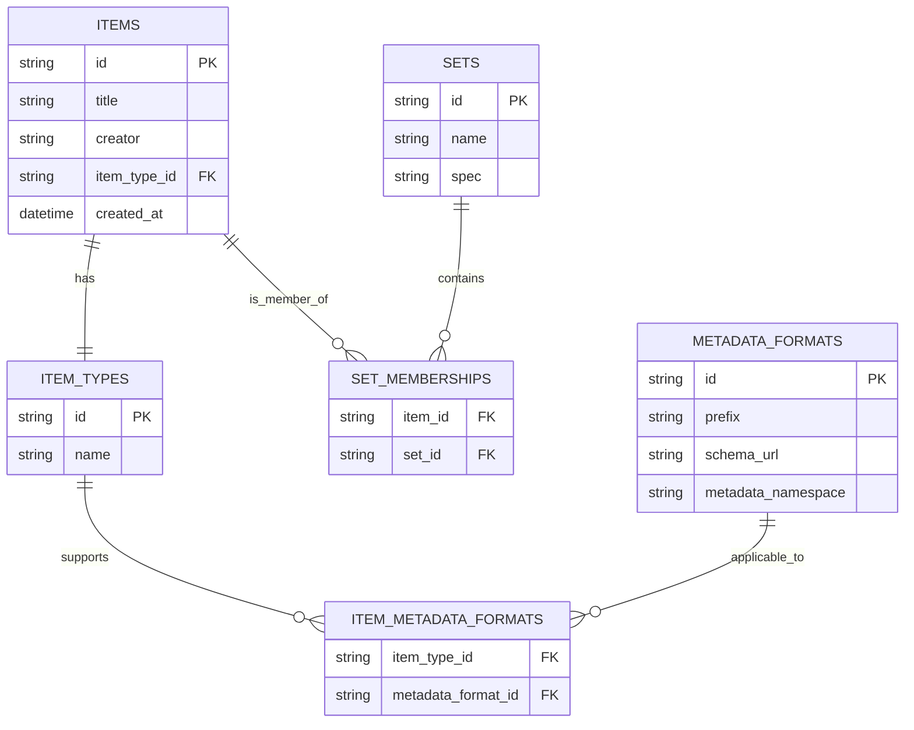

# OAI-PMH Domain Model

## Overview


This document outlines the key concepts and entities involved in the OAI-PMH (Open Archives Initiative Protocol for Metadata Harvesting) system.

## Key Concepts
The following table summarizes the key concepts in the OAI-PMH domain model. Each concept is defined with its purpose and role within the system.
| Concept Name         | Description                                                                 |
|----------------------|-----------------------------------------------------------------------------|
| Item                | Represents a single record or object in the repository.                     |
| MetadataRecord      | Encapsulates metadata and its header for a given item.                      |
| Identifier          | A globally unique identifier for an item.                                  |
| Datestamp           | Represents the last modified time of a record, critical for selective harvesting. |
| Set                 | Represents logical groupings of items; may be hierarchical.                |
| MetadataFormat      | Defines a supported format with schema, namespace, and prefix.             |
| Repository          | The aggregate root that exposes the collection of Items, Sets, and supported Verbs. |
| ResumptionToken     | A pagination token for managing large result sets in harvesting.           |
| Verb                | Represents the 6 allowed operations (e.g. Identify, ListRecords).         |

Then next table provide key concepts which are not part of the OAI-PMH protocol but are important for understanding the domain model.
| Concept Name        | Description                                                                 |
|---------------------|-----------------------------------------------------------------------------|
| ItemType           | Represents the type of an item, which can be used to filter or categorize items. |
| ItemMetadataFormat | Represents the relationship between ItemTypes and MetadataFormats.               |
| SetMembership      | Represents the relationship between Items and Sets.                            |

## Repository
A **repository** is a server that exposes structured metadata about resources through a standardized protocol. It is a network-accessible server that can process OAI-PMH requests and return responses formatted in XML. The repository acts as a data provider in the OAI-PMH ecosystem, allowing service providers to harvest metadata from multiple repositories. Key characteristics of a repository include:
- **Metadata Exposure**: The repository exposes metadata records, which are typically about digital objects such as articles, datasets, or images. It does not necessarily provide the full content of these resources.
- **Standardized Responses**: All responses from the repository follow the OAI-PMH XML schema and protocol, ensuring consistency and interoperability.
- **Support for Six Protocol Requests (Verbs)**: The repository supports six protocol requests (verbs) that allow service providers to interact with the metadata. These verbs include:
  - `Identify`: Get information about the repository.
  - `ListMetadataFormats`: Find available metadata formats.
  - `ListSets`: List sets (optional grouping of records).
  - `ListIdentifiers`: Get record identifiers.
  - `ListRecords`: Get metadata records.
  - `GetRecord`: Retrieve a specific metadata record.

A repository is the **source of metadata** for harvesters, which are client applications that collect and aggregate metadata from multiple repositories.

## Item
An **item** is a core conceptual entity within a repository. It acts as a container that groups all metadata records associated with a single resource. It has the following characteristics:
- **Unique Identifier**: Each item is assigned a unique identifier, typically in the form of a URI. This identifier is used to refer to the item when harvesting metadata.
- **Represents a Resource**: An item corresponds to a specific resource. The nature of the resource is not restricted by OAI-PMH — it can be digital (like an image or PDF) or non-digital (like a book or artifact).
- **Multiple Metadata Records**: An item can have one or more associated metadata records, each in a different metadata format (e.g., Dublin Core, MARCXML). This supports metadata interoperability across systems.
- **Optional Set Membership**: Items may be grouped into *sets*, which are used for selective harvesting. An item can belong to zero, one, or multiple sets.

## Unique Identifier in OAI-PMH
A **unique identifier** is a critical concept in the OAI-PMH protocol, as it serves as the primary means of identifying and accessing metadata records. It is essential for ensuring that each record can be uniquely referenced and retrieved by clients. It is a string that is globally unique within the context of the repository and is used to identify a specific item or record. It has the following characteristics:
- **Globally Unique**: The identifier must be unique across all items in the repository and should not be reused.
- **Stable**: The identifier should remain unchanged for the lifetime of the item. If an item is updated or modified, its identifier should not change.
- **Repository-assigned**: The repository is responsible for generating and managing the unique identifiers. They are typically assigned when the item is created or ingested into the repository.
- **Opaque**: The identifier should not convey any information about the item itself. Clients should not attempt to infer any meaning or structure from the identifier.

There are no restrictions on the format of the identifier, but it is recommended to use a URI-like syntax to ensure interoperability. The identifier should be a string that can be easily parsed and understood by both humans and machines. A proposed format is to use the **OAI Identifier** scheme `oai:[repositoryId]:[localIdentifier]`, where:
- `oai` is the scheme identifier.
- `repositoryId` is a unique identifier for the repository (e.g., domain name).
- `localIdentifier` is a unique identifier assigned by the repository for the specific item.

The unique identifier is used in the following OAI-PMH operations:
- `GetRecord`
- `Identify`
- `ListIdentifiers`
- `ListRecords` (as part of the metadata record headers)

The purpose of the unique identifier is to provide a consistent and reliable way to reference items across different repositories and systems. It allows clients to retrieve specific metadata records and ensures that the same item can be accessed consistently, regardless of the metadata format or protocol used.

## Record
A **record** in OAI-PMH is a structured representation of metadata about a specific item in a repository. It is the fundamental unit of information that is exchanged between repositories and service providers. Each record contains metadata about an item, including its unique identifier, datestamp, and the actual metadata content in a specific format.

Structurally, a record consists of three main components:
1. **Header**: Contains metadata about the record itself, including the unique identifier, datestamp, and optional set membership.
2. **Metadata**: The actual metadata content about the item, expressed in a specific format (e.g., Dublin Core, MODS).
3. **About (optional)**: Additional information about the metadata itself, such as rights statements or provenance information.

Example Record Structure

```xml
<record>
  <header>
    <identifier>oai:example.org:record123</identifier>
    <datestamp>2025-05-18</datestamp>
    <setSpec>collectionA</setSpec>
  </header>
  <metadata>
    <oai_dc:dc xmlns:oai_dc="http://www.openarchives.org/OAI/2.0/oai_dc/"
               xmlns:dc="http://purl.org/dc/elements/1.1/">
      <dc:title>Sample Record Title</dc:title>
      <dc:creator>Jane Doe</dc:creator>
      <dc:subject>Metadata Harvesting</dc:subject>
      <dc:description>This is a sample description of the record.</dc:description>
      <dc:publisher>Example Publisher</dc:publisher>
      <dc:date>2025-05-18</dc:date>
      <dc:type>Text</dc:type>
      <dc:identifier>http://example.org/record123</dc:identifier>
    </oai_dc:dc>
  </metadata>
  <about>
    <rights xmlns="http://www.openarchives.org/OAI/2.0/rights/">
      <rightsStatement>This metadata is licensed under CC BY 4.0.</rightsStatement>
    </rights>
  </about>
</record>
```

Additional Notes
- **Uniqueness**: A record is uniquely identified by the combination of the item's identifier, the metadata format (`metadataPrefix`), and the datestamp.
- **Multiple Formats**: An item may have multiple records, each in a different metadata format.
- **Selective Harvesting**: The `datestamp` and `setSpec` elements facilitate selective harvesting by allowing harvesters to request records based on date ranges or set memberships.

### Deleted Records
OAI-PMH supports a mechanism for signaling that a record has been deleted. This is controlled by the repository's **deletion policy**, which may be:
- `no`: The repository does not maintain information about deletions.
- `transient`: The repository may indicate deletions, but not necessarily permanently.
- `persistent`: The repository retains knowledge of deletions indefinitely.

When a record is deleted:
- Only the `<header>` element is returned.
- The `<metadata>` and `<about>` elements are omitted.
- The `<header>` includes the attribute `status="deleted"`.

Example of a Deleted Record

```xml
<record>
  <header status="deleted">
    <identifier>oai:example.org:record123</identifier>
    <datestamp>2025-05-18</datestamp>
  </header>
</record>
```

Harvesters can use this information to remove or update local copies of records accordingly.

### Items vs. Records

While an **item** represents a resource, a **record** is a single instance of metadata about that resource in a specific format.

Each metadata record includes:
- **Header**: Contains the item’s identifier, a datestamp (indicating last update), and optional set membership.
- **Metadata**: The actual descriptive metadata in XML format.
- **About** *(optional)*: Additional metadata about the metadata itself (e.g., rights information).

### Summary

An `item` in OAI-PMH is an abstraction for a resource, grouping together all metadata records about that resource, potentially in multiple formats. It is the fundamental unit targeted by metadata harvesters.

## OAI-PMH: Understanding Sets
A set is a logical grouping of items within a repository. It allows repositories to organize their metadata records into collections based on specific criteria, enabling selective harvesting by service providers. Sets are optional constructs in OAI-PMH, meaning that not all repositories are required to implement them. However, they can be beneficial for both repositories and harvesters in terms of organization and efficiency.

The purpose of sets is to provide a way to categorize and group items within a repository. This can be particularly useful for large repositories with diverse collections, as it allows harvesters to request metadata from specific subsets of the repository rather than retrieving all records.
Sets can be defined based on various criteria, such as:
- Subject matter (e.g., collections related to specific research areas)
- Resource type (e.g., images, articles, datasets)
- Institutional affiliation (e.g., collections from specific departments or institutions)
- Any other classification that suits the repository's organizational needs
Sets are defined by the repository and can be hierarchical, meaning that sets can contain other sets. This allows for a more granular organization of metadata records.

The structure of a set in OAI-PMH includes the following components:
- **setSpec**: A unique identifier for the set within the repository. This is typically a short string that serves as a reference to the set.
- **setName**: A human-readable name for the set. This is intended for display purposes and should provide a clear description of the contents of the set.
- **setDescription** (optional): Additional information about the set, which can include metadata such as rights information or descriptive details. This is not required but can provide valuable context for harvesters.

Example

```xml
<set>
  <setSpec>physics:quantum</setSpec>
  <setName>Quantum Physics Collection</setName>
  <setDescription>
    <dc:description>This set contains metadata records related to quantum physics research.</dc:description>
  </setDescription>
</set>
```

### Hierarchical Sets

OAI-PMH supports a hierarchical structure for sets, allowing for nested groupings. This hierarchy is implied through the use of colons (`:`) in the `setSpec`.

Example Hierarchy

```xml
<setSpec>physics</setSpec>
<setSpec>physics:quantum</setSpec>
<setSpec>physics:relativity</setSpec>
In this example:
```

physics is a top-level set.

physics:quantum and physics:relativity are subsets of physics.

Note: While the hierarchy is implied, OAI-PMH does not enforce inheritance of records from parent to child sets. Each set is treated independently.

### Records and Set Membership
- **Multiple Set Membership**: A single metadata record can belong to multiple sets.
- **No Set Membership**: Records are not required to belong to any set.
- **Set Specification in Records**: When a record is part of a set, its header will include the corresponding `setSpec`.

Example Record Header
```xml
<header>
  <identifier>oai:example.org:record123</identifier>
  <datestamp>2025-05-18</datestamp>
  <setSpec>physics:quantum</setSpec>
  <setSpec>research:2025</setSpec>
</header>
```

In this example, the record belongs to both the physics:quantum and research:2025 sets.

### Harvesting Sets
Harvesters can retrieve information about available sets using the ListSets verb:

```http
GET http://www.example.org/oai?verb=ListSets
```
To harvest records from a specific set, include the set parameter:

```http
GET http://www.example.org/oai?verb=ListRecords&metadataPrefix=oai_dc&set=physics:quantum
```
This request retrieves records from the physics:quantum set in the Dublin Core (oai_dc) metadata format.

### Implementation Considerations
- **Optional Feature**: Implementing sets is optional for repositories. Not all repositories will have sets defined.
- **Set Hierarchy**: While a hierarchical structure can be implied through setSpec, OAI-PMH does not define semantics for set hierarchies. Repositories may choose to implement sets in a flat or hierarchical manner based on their organizational needs.
- **Empty Sets**: Repositories may define sets that currently have no records. This allows for future growth and organization of metadata.
- **Set Definition**: The meaning and criteria for sets are determined by the repository and may be based on internal policies or agreements with service providers.

## Entity-Relationship Diagram (ERD)


