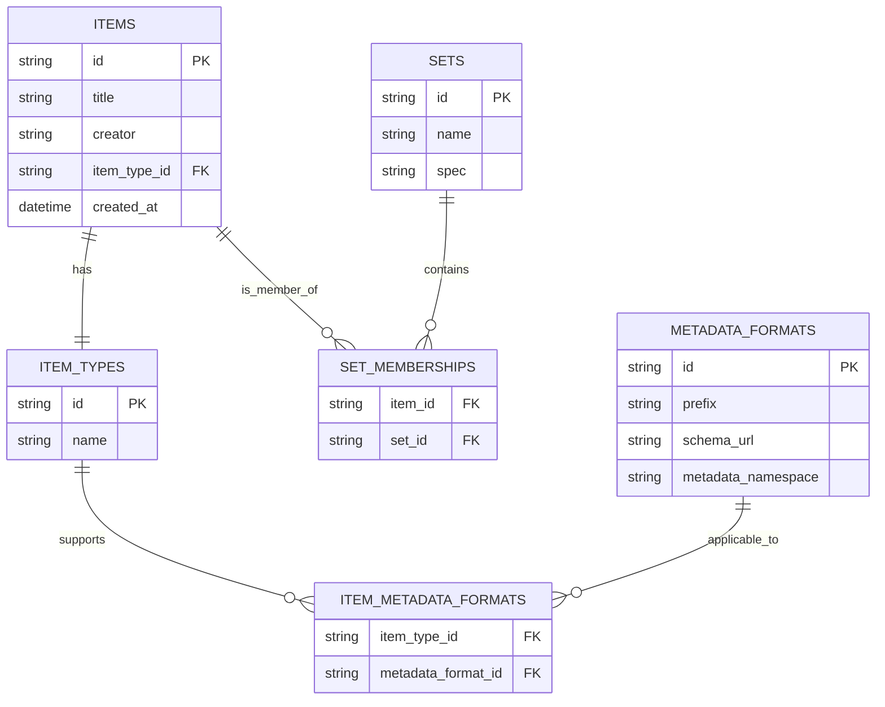

```mermaid
erDiagram
    ITEMS ||--|| ITEM_TYPES : has
    ITEMS ||--o{ SET_MEMBERSHIPS : is_member_of
    SETS ||--o{ SET_MEMBERSHIPS : contains
    ITEM_TYPES ||--o{ ITEM_METADATA_FORMATS : supports
    METADATA_FORMATS ||--o{ ITEM_METADATA_FORMATS : applicable_to

    ITEMS {
        string id PK
        string title
        string creator
        string item_type_id FK
        datetime created_at
    }

    ITEM_TYPES {
        string id PK
        string name
    }

    METADATA_FORMATS {
        string id PK
        string prefix
        string schema_url
        string metadata_namespace
    }

    SETS {
        string id PK
        string name
        string spec
    }

    SET_MEMBERSHIPS {
        string item_id FK
        string set_id FK
    }

    ITEM_METADATA_FORMATS {
        string item_type_id FK
        string metadata_format_id FK
    }
```
